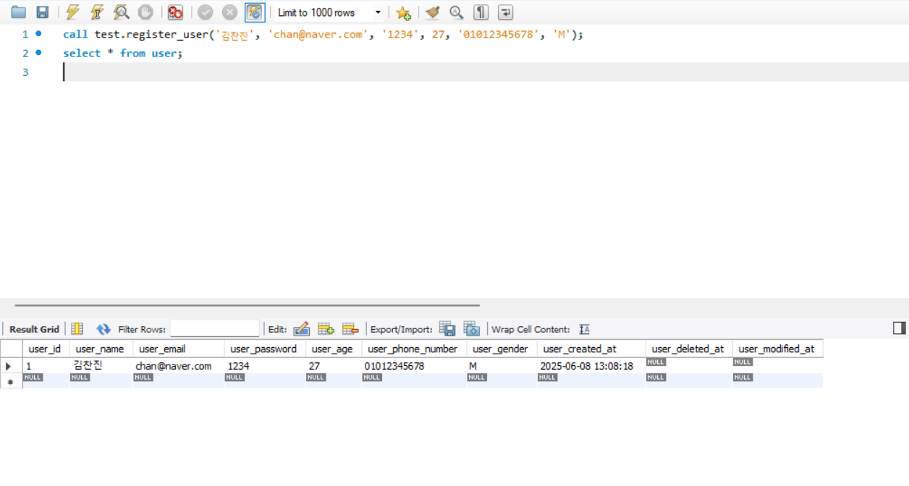
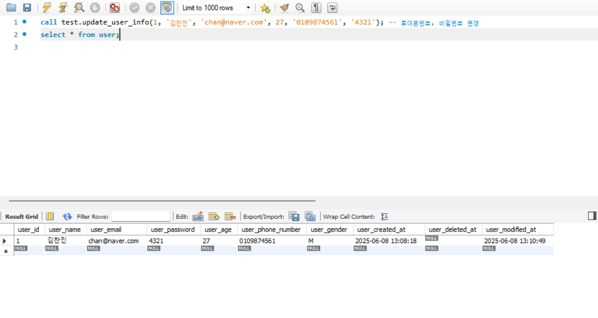
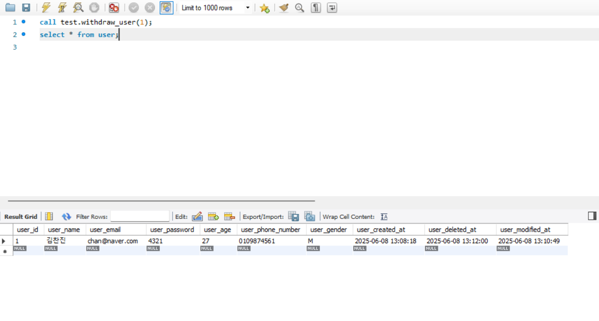
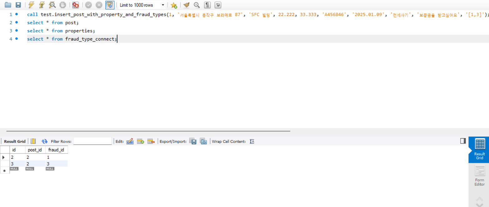
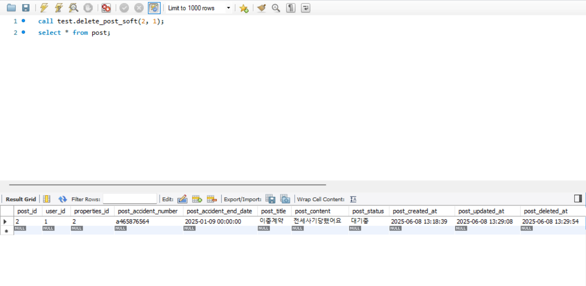
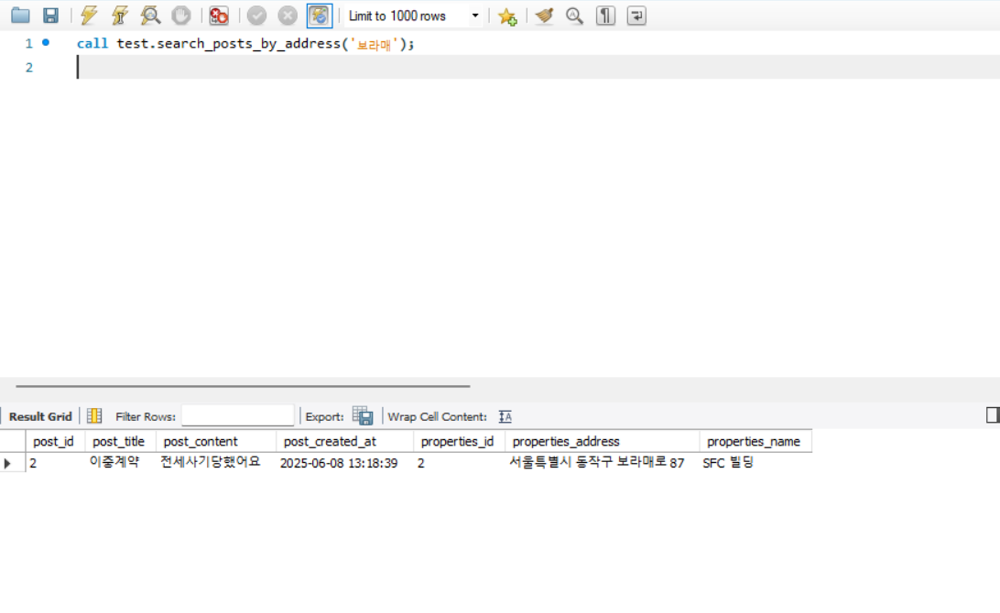
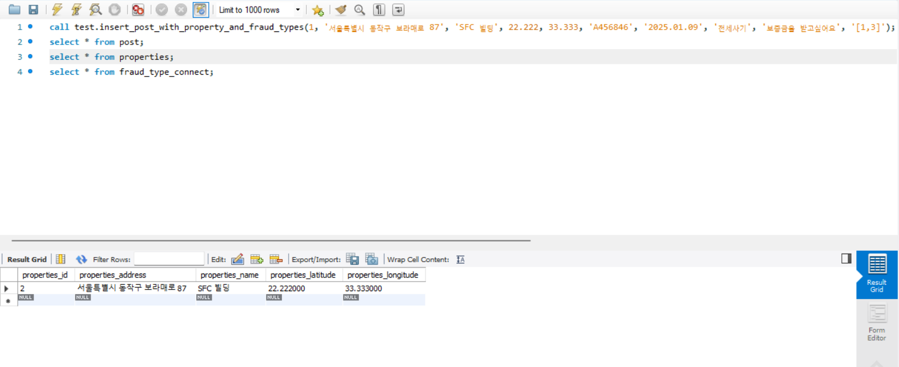
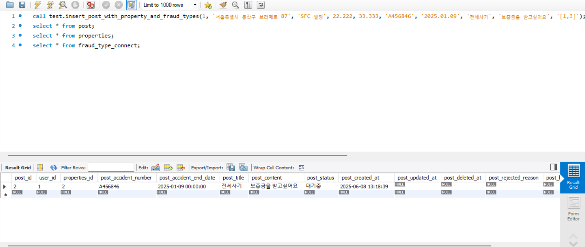

# 🏚️ MASTERNSLAVES - HomeProtector
<br>
<p align="center">
  
</p>

<details>
  <summary>로고 제작 과정</summary>
   
</details>

<h2>👥 팀원 소개</h2>
<table>
  <tr>
    <td align="center">
      
    </td>
    <td align="center">
      
    </td>
    <td align="center">
      
    </td>
    <td align="center">
      
    </td>
  </tr>
    <tr>
    <td align="center"> 김건동</td>
    <td align="center"> 김찬진</td>
    <td align="center">김진호</td>
    <td align="center"> 이우영 </td>
  </tr>
  <tr>
    <td align="center"><a href="https://github.com/astraglus03" target="_blank"></a>
    </td>
    <td align="center"><a href="https://github.com/Chanjin629" target="_blank"></a>
    </td>
    <td align="center"><a href="https://github.com/jinnn12" target="_blank"></a> 
    </td>
    <td align="center"><a href="https://github.com/ggj0228" target="_blank"></a>
    </td>
  </tr>
</table>

<br>

## 🎬🎞️ 프로젝트 개요

<h3>01_프로젝트 주제</h3>

&nbsp;전·월세 사기 피해자들이 실제 겪은 경험을 공유하고 상호작용하는 정보 공유 기반 커뮤니티 시스템
 

<h3>02_프로젝트 소개</h3>

&nbsp;최근 급증하는 전세사기 피해 사례는 단순한 금융 피해를 넘어 주거 안정성 자체를 위협하고 있습니다. 2024년 1월 기준, 전세사기피해지원위원회에서 피해자로 공식 인정된 사례는 총 10,944건이며, 이 중 70% 이상이 40세 미만 청년층에 집중되어 있습니다. 청년과 사회초년생이 주로 거주하는 소형 다세대, 오피스텔, 다가구주택 등이 주요 피해 대상이라는 점에서, 정보의 비대칭과 취약한 법적 방어력이 전세사기의 근본 원인으로 작용하고 있음을 시사 하고 있습니다. 이러한 전·월세 사기를 방지하고자 이미 피해를 본 사례를 등록하여 정보를 공유하고 서로 질문하는 시스템의 커뮤니티 서비스를 즐겨보세요!

<h3>03_프로젝트 필요성</h3>

1. 증가하는 전·월세 사기<br>
 2024년 1월 기준, 피해자 공식 인정 건수는 10,944건으로 더 많은 전세사기가 일어나고 있다고 추산됩니다. 또한 더욱 경기가 안좋게 흘러감으로써 집주인이 건물을 두고 도망가는 상황이 많이 펼쳐지며 HUG에서도 보증해주려 하지 않고있으며 현재 피해자중 20~30대의 비율이 72.9%로 7,984건 입니다. 이러한 점에서 더욱더 사기가 일어나면 안되며 SNS시대에서 정보공유가 필수적이라고 강조합니다.

<div>
 
 
</div>
출처: 국토교통부(https://jeonse.kgeop.go.kr/) 

<br><br>
2. 감소하는 인구 비율<br>
&nbsp;현재 인구가 매우 큰 폭으로 감소하고 있으며 현재 출산율이 0.75로 증가했음에도 아직 1이 넘지 않는것이 현실입니다. 또한 지금 지역별 출산율은 증가했을 수 있지만 전체 지역 합계 출산율로 계산해 보았을때 지속적으로 감소중입니다. 새로운 시대의 젊은 세대가 아이를 출산하기 위해서라도 사기가 일어나지않는 재발 방지 목적이 필요하다고 판단하였습니다.

 
출처: 대한민국 정책브리핑(https://www.korea.kr/news/policyNewsView.do?newsId=148940038)

<h3>04_프로젝트 주요 기능</h3>

- **피해 사례 등록**: 본인 인증 문서와 계약서를 기반으로 사건의 게시글을 등록 할 수 있습니다.
- **건물 검색**: 주소를 통해 해당 건물의 경매사건 후기를 조회 할 수 있습니다.
- **관리자 승인**: 등록된 글은 관리자가 검토 후 공개 할 수 있습니다.
- **커뮤니티 기능**: 댓글 및 피해사례 공유할 수 있습니다.
- **전문가와의 매칭**: 일반 사용자가 전문가와 매칭됨으로써 문제를 해결 할 수 있다.

<h3>05_서비스 차별화 전략</h3>

- **사건의 조회를 넘어서 정보를 공유함으로써 사기 예방이 가능하다.**  

<br>

## ⚙️🛠️ Technical Stack

<h2>DB</h2>

<a href="https://mariadb.org" target="_blank">
  
</a>

<h2>Tool</h2>

<div>


  
</div>

<br>

## 🗓️ WBS

<details>
  <summary>WBS 보기</summary>
   
</details>
<div style="font-size: 1.5em; font-weight: bold; margin-top: 20px;">
  <a href='https://docs.google.com/spreadsheets/d/15pLhr2YpBQbEitgeisUuU08xiQDuqLblhvuWDRGMyNs/edit?gid=632033879#gid=632033879' style="text-decoration: none; color: inherit;">
    WBS
  </a>
</div>

<br>

## 🧾 요구사항 명세서

<details>
  <summary>요구사항 명세서 보기</summary>
   
</details>

<div style="font-size: 1.5em; font-weight: bold; margin-top: 20px;">
  <a href='https://docs.google.com/spreadsheets/d/15pLhr2YpBQbEitgeisUuU08xiQDuqLblhvuWDRGMyNs/edit?gid=538827036#gid=538827036' style="text-decoration: none; color: inherit;">
    요구사항 명세서
  </a>
</div>

## 🧱 ERD

<details>
  <summary>ERD 보기</summary>
   
</details>
<div style="font-size: 1.5em; font-weight: bold; margin-top: 20px;">
  <a href='https://www.erdcloud.com/d/DvuCQXPY5ve8hbFBH' style="text-decoration: none; color: inherit;">
    ERD
  </a>
</div>

<br>

## 🧾 DDL
<details>
  <summary>DDL</summary>
  <details>
  <summary>1. 회원 테이블 생성하기</summary>

  ```sql
-- 유저 테이블
CREATE TABLE user (	
user_id BIGINT UNSIGNED NOT NULL AUTO_INCREMENT,	
user_name VARCHAR(255) NOT NULL,	
user_email VARCHAR(255) NOT NULL UNIQUE,	
user_password VARCHAR(255) NOT NULL,	
user_age INT UNSIGNED NOT NULL,	
user_phone_number VARCHAR(255) NOT NULL UNIQUE,	
user_gender VARCHAR(255) NOT NULL,	
user_created_at DATETIME NOT NULL DEFAULT CURRENT_TIMESTAMP,	
user_deleted_at DATETIME NULL,	
user_modified_at DATETIME NULL,	
PRIMARY KEY (user_id)	
);	
  ```
  </details>
    <details>
  <summary>2. 관리자 테이블 생성하기</summary>

  ```sql
-- 관리자 테이블
CREATE TABLE admin (			
admin_id BIGINT UNSIGNED NOT NULL AUTO_INCREMENT,			
admin_name VARCHAR(255) NOT NULL,			
admin_email VARCHAR(255) NOT NULL UNIQUE,			
admin_password VARCHAR(255) NOT NULL,			
admin_com_num VARCHAR(255) NOT NULL,			
admin_created_at DATETIME NOT NULL DEFAULT CURRENT_TIMESTAMP,			
admin_end_at DATETIME NULL,			
PRIMARY KEY (admin_id)			
);			

  ```
  </details>
    <details>
  <summary>3. 부동산 정보 테이블 생성하기</summary>

  ```sql
-- 부동산 정보
CREATE TABLE properties (		
properties_id BIGINT UNSIGNED NOT NULL AUTO_INCREMENT,		
properties_address VARCHAR(255) NOT NULL,		
properties_name VARCHAR(255) NULL,		
properties_latitude DECIMAL(9,6) NULL,		
properties_longitude DECIMAL(9,6) NULL,		
PRIMARY KEY (properties_id)		
);		
  ```
  </details>
    <details>
  <summary>4. 전문가 테이블 생성하기</summary>

  ```sql
-- 전문가 테이블
CREATE TABLE expert (	
expert_id BIGINT UNSIGNED NOT NULL AUTO_INCREMENT,	
expert_name VARCHAR(255) NOT NULL,	
contact VARCHAR(255) NOT NULL,	
password VARCHAR(255) NOT NULL,	
qualify_type VARCHAR(255) NOT NULL,	
qualify_num VARCHAR(255) NOT NULL UNIQUE,	
created_at DATETIME NOT NULL,	
updated_at DATETIME NULL,	
deleted_at DATETIME NULL,	
PRIMARY KEY (expert_id)	
);	
  ```
  </details>
    <details>
  <summary>5. 사기타입 테이블 생성하기</summary>

  ```sql
-- 사기유형 테이블
CREATE TABLE fraud_type (			
fraud_id BIGINT UNSIGNED NOT NULL AUTO_INCREMENT,			
fraud_type VARCHAR(255) NOT NULL,			
PRIMARY KEY (fraud_id)			
);			
  ```
  </details>
    <details>
  <summary>6. 피해 테이블 생성하기</summary>

  ```sql
-- 피해 게시글
CREATE TABLE post (		
post_id BIGINT UNSIGNED NOT NULL AUTO_INCREMENT,		
user_id BIGINT UNSIGNED NOT NULL,		
properties_id BIGINT UNSIGNED NOT NULL,		
post_accident_number VARCHAR(255) NOT NULL,		
post_accident_end_date DATETIME NOT NULL,		
post_title VARCHAR(255) NOT NULL,		
post_content TEXT NOT NULL,		
post_status ENUM('대기중', '승인', '반려') NOT NULL DEFAULT '대기중',		
post_created_at DATETIME NOT NULL DEFAULT CURRENT_TIMESTAMP,		
post_updated_at DATETIME NULL,		
post_deleted_at DATETIME NULL,		
post_rejected_reason VARCHAR(255) NULL,		
post_like_count INT UNSIGNED NULL,		
approve_admin BIGINT UNSIGNED NULL,		
PRIMARY KEY (post_id),		
FOREIGN KEY (user_id) REFERENCES user (user_id),		
FOREIGN KEY (properties_id) REFERENCES properties (properties_id)		
);		
  ```
  </details>
    <details>
  <summary>7. 질문 테이블 생성하기</summary>

  ```sql
-- 질문 게시글
CREATE TABLE inquiry (		
inquiry_id BIGINT UNSIGNED NOT NULL AUTO_INCREMENT,		
user_id BIGINT UNSIGNED NOT NULL,		
inquiry_title VARCHAR(255) NOT NULL,		
inquiry_contents TEXT NOT NULL,		
inquiry_created_at DATETIME NOT NULL DEFAULT CURRENT_TIMESTAMP,		
inquiry_updated_at DATETIME NULL,		
inquiry_deleted_at DATETIME NULL,
inquiry_like_count INT UNSIGNED NOT NULL DEFAULT 0,
PRIMARY KEY (inquiry_id),		
FOREIGN KEY (user_id) REFERENCES user (user_id)		
);			
  ```
  </details>
    <details>
  <summary>8. 공지사항 테이블 생성하기</summary>

  ```sql
-- 공지사항 테이블
CREATE TABLE notice (	
announce_id BIGINT UNSIGNED NOT NULL AUTO_INCREMENT,	
admin_id BIGINT UNSIGNED NOT NULL,	
announce_title VARCHAR(255) NOT NULL,	
announce_content TEXT NOT NULL,	
announce_post_file VARCHAR(255) NULL,	
announce_create_at DATETIME NOT NULL DEFAULT CURRENT_TIMESTAMP,	
announce_updated_at DATETIME NULL,	
announce_deleted_at DATETIME NULL,	
PRIMARY KEY (announce_id),	
FOREIGN KEY (admin_id) REFERENCES admin (admin_id)	
);	
  ```
  </details>
    <details>
  <summary>9. 상담 테이블 생성하기</summary>

  ```sql
-- 상담 게시글 테이블
CREATE TABLE counsel (		
counsel_id BIGINT NOT NULL AUTO_INCREMENT,		
user_id BIGINT UNSIGNED NOT NULL,		
expert_id BIGINT UNSIGNED NOT NULL,		
title VARCHAR(255) NOT NULL,		
contents TEXT NOT NULL,		
created_at DATETIME NOT NULL DEFAULT CURRENT_TIMESTAMP,		
updated_at DATETIME NULL,		
deleted_at DATETIME NULL,		
category ENUM('법률', '공인중개사') NOT NULL DEFAULT '법률',		
status ENUM('대기중', '승인') NOT NULL DEFAULT '대기중',		
PRIMARY KEY (counsel_id),		
FOREIGN KEY (user_id) REFERENCES user (user_id),		
FOREIGN KEY (expert_id) REFERENCES expert (expert_id)		
);	
  ```
  </details>
      <details>
  <summary>10. 댓글 테이블 생성하기</summary>

  ```sql
-- 댓글 테이블
CREATE TABLE reply (		
reply_id BIGINT UNSIGNED NOT NULL AUTO_INCREMENT,		
post_id BIGINT UNSIGNED,		
user_id BIGINT UNSIGNED NOT NULL,		
inquiry_id BIGINT UNSIGNED,		
reply_content VARCHAR(255) NOT NULL,		
reply_created_at TIMESTAMP NOT NULL DEFAULT CURRENT_TIMESTAMP,		
reply_modified_at TIMESTAMP NULL,		
reply_deleted_at TIMESTAMP NULL,		
reply_parent_id INT UNSIGNED NULL,		
PRIMARY KEY (reply_id),		
FOREIGN KEY (post_id) REFERENCES post (post_id),		
FOREIGN KEY (user_id) REFERENCES user (user_id),		
FOREIGN KEY (inquiry_id) REFERENCES inquiry (inquiry_id)		
);			
  ```
  </details>
      <details>
  <summary>11. 증빙자료 테이블 생성하기</summary>

  ```sql
-- 증명자료 테이블
CREATE TABLE proof (	
proof_id BIGINT UNSIGNED NOT NULL AUTO_INCREMENT,	
post_id BIGINT UNSIGNED NULL,	
expert_id BIGINT UNSIGNED NULL,	
proof_file_path VARCHAR(255) NOT NULL,	
PRIMARY KEY (proof_id),	
FOREIGN KEY (post_id) REFERENCES post (post_id),	
FOREIGN KEY (expert_id) REFERENCES expert (expert_id)	
);
  ```
  </details>
      <details>
  <summary> 12. 신고 테이블 생성하기</summary>

  ```sql
-- 신고 테이블
CREATE TABLE report (		
report_id BIGINT UNSIGNED NOT NULL AUTO_INCREMENT,		
user_id BIGINT UNSIGNED NOT NULL,		
post_id BIGINT UNSIGNED,		
admin_id BIGINT UNSIGNED NULL,		
reply_id BIGINT UNSIGNED,		
report_resason TEXT NOT NULL,		
report_date DATETIME NOT NULL DEFAULT CURRENT_TIMESTAMP,		
report_status ENUM('대기중', '완료', '반려') NOT NULL DEFAULT '대기중',		
report_action VARCHAR(255) NULL,		
report_processed_at DATETIME NULL,		
PRIMARY KEY (report_id),		
FOREIGN KEY (user_id) REFERENCES user (user_id),		
FOREIGN KEY (post_id) REFERENCES post (post_id),		
FOREIGN KEY (admin_id) REFERENCES admin (admin_id),		
FOREIGN KEY (reply_id) REFERENCES reply (reply_id)		
);		
  ```
  </details>
      <details>
  <summary>13. 알림 테이블 생성하기</summary>

  ```sql
-- 알림 테이블
CREATE TABLE alerts (	
notice_id BIGINT UNSIGNED NOT NULL AUTO_INCREMENT,	
user_id BIGINT UNSIGNED NOT NULL,	
reply_id BIGINT UNSIGNED NULL,	
post_id BIGINT UNSIGNED NULL,	
inquiry_id BIGINT UNSIGNED NULL,	
notice_message TEXT NULL,	
notice_isread VARCHAR(255) NULL,	
PRIMARY KEY (notice_id),	
FOREIGN KEY (user_id) REFERENCES user (user_id),	
FOREIGN KEY (reply_id) REFERENCES reply (reply_id),	
FOREIGN KEY (post_id) REFERENCES post (post_id),	
FOREIGN KEY (inquiry_id) REFERENCES reply (inquiry_id)	
);	
  ```
  </details>
      <details>
  <summary>14. 로그 테이블 생성하기</summary>

  ```sql
-- 로그 테이블
CREATE TABLE log_list (	
log_id BIGINT UNSIGNED NOT NULL AUTO_INCREMENT,	
user_id BIGINT UNSIGNED NOT NULL,	
action VARCHAR(255) NOT NULL,	
entity_type VARCHAR(255) NOT NULL,	
performed_at DATETIME NOT NULL DEFAULT CURRENT_TIMESTAMP,	
details VARCHAR(255) NULL,	
PRIMARY KEY (log_id),	
FOREIGN KEY (user_id) REFERENCES user (user_id)	
);
  ```
  </details>
      <details>
  <summary>15. 피해 게시글 좋아요 테이블 생성하기</summary>

  ```sql
-- 피해 게시글 좋아요
CREATE TABLE post_like (			
like_id BIGINT UNSIGNED NOT NULL AUTO_INCREMENT,			
post_id BIGINT UNSIGNED NOT NULL,			
user_id BIGINT UNSIGNED NOT NULL,			
liked_created_at DATETIME NOT NULL DEFAULT CURRENT_TIMESTAMP,			
PRIMARY KEY (like_id),			
UNIQUE (post_id, user_id),			
FOREIGN KEY (post_id) REFERENCES post (post_id),			
FOREIGN KEY (user_id) REFERENCES user (user_id)			
);	
  ```
  </details>
      <details>
  <summary>16. 질문 게시글 좋아요 테이블 생성하기</summary>

  ```sql
-- 질문 게시글 좋아요
CREATE TABLE inquiry_like (	
like_id BIGINT UNSIGNED NOT NULL AUTO_INCREMENT,	
inquiry_id BIGINT UNSIGNED NOT NULL,	
user_id BIGINT UNSIGNED NOT NULL,	
liked_created_at DATETIME NOT NULL DEFAULT CURRENT_TIMESTAMP,	
PRIMARY KEY (like_id),	
UNIQUE (inquiry_id, user_id),	
FOREIGN KEY (inquiry_id) REFERENCES inquiry (inquiry_id),	
FOREIGN KEY (user_id) REFERENCES user (user_id)	
);			
	
  ```
  </details>
  
</details>

<hr>


## 🧾⏳⏰ DML 및 테스트케이스 진행.

<details>
  <summary>DML</summary>
  <details>
     <summary>회원 관련</summary>
      <details>
  <summary> 1. 회원 등록</summary>
  
  
```sql
DELIMITER // -- 회원등록

CREATE PROCEDURE register_user (
    IN p_name VARCHAR(255),
    IN p_email VARCHAR(255),
    IN p_password VARCHAR(255),
    IN p_age INT UNSIGNED,
    IN p_phone VARCHAR(255),
    IN p_gender VARCHAR(255)
)
BEGIN
    DECLARE EXIT HANDLER FOR SQLEXCEPTION
    BEGIN
        ROLLBACK;
        SIGNAL SQLSTATE '45000' SET MESSAGE_TEXT = '회원가입 중 오류가 발생했습니다.';
    END;

    START TRANSACTION;

    -- 이메일 중복 확인
    IF EXISTS (
        SELECT 1 FROM user WHERE user_email = p_email
    ) THEN
        SIGNAL SQLSTATE '45000'
        SET MESSAGE_TEXT = '이미 사용 중인 이메일입니다.';
    END IF;

    -- 전화번호 중복 확인
    IF EXISTS (
        SELECT 1 FROM user WHERE user_phone_number = p_phone
    ) THEN
        SIGNAL SQLSTATE '45000'
        SET MESSAGE_TEXT = '이미 사용 중인 전화번호입니다.';
    END IF;

    -- 회원 등록
    INSERT INTO user (
        user_name,
        user_email,
        user_password,
        user_age,
        user_phone_number,
        user_gender
    ) VALUES (
        p_name,
        p_email,
        p_password,
        p_age,
        p_phone,
        p_gender
    );

    COMMIT;
END;
//

DELIMITER ;
```
</details>
          <details>
     <summary> 2. 회원 수정</summary>
        
            
  ```sql
        -- 회원정보수정
    DELIMITER // 
    CREATE PROCEDURE update_user_info (
        IN p_user_id BIGINT,
        IN p_name VARCHAR(255),
        IN p_email VARCHAR(255),
        IN p_age INT,
        IN p_phone VARCHAR(255),
        IN p_password VARCHAR(255)
    )
    BEGIN
        DECLARE EXIT HANDLER FOR SQLEXCEPTION
        BEGIN
            ROLLBACK;
            SIGNAL SQLSTATE '45000' SET MESSAGE_TEXT = '회원 정보 수정 중 오류 발생';
        END;

    START TRANSACTION;

    -- 전화번호 중복 체크 (자기 자신 제외)
    IF EXISTS (
        SELECT 1 FROM user
        WHERE user_phone_number = p_phone AND user_id != p_user_id
    ) THEN
        SIGNAL SQLSTATE '45000'
        SET MESSAGE_TEXT = '이미 등록된 전화번호입니다.';
    END IF;

    -- 이메일 중복 체크 (자기 자신 제외)
    IF EXISTS (
        SELECT 1 FROM user
        WHERE user_email = p_email AND user_id != p_user_id
    ) THEN
        SIGNAL SQLSTATE '45000'
        SET MESSAGE_TEXT = '이미 등록된 이메일입니다.';
    END IF;

    -- 사용자 정보 수정
    UPDATE user
    SET
        user_name = p_name,
        user_email = p_email,
        user_age = p_age,
        user_phone_number = p_phone,
        user_password = p_password,
        user_modified_at = NOW()
    WHERE user_id = p_user_id;

    COMMIT;
    END;
    //
    
    DELIMITER ;
 ```
  </details>
          <details>
     <summary> 3. 회원 탈퇴</summary>
        
  
  ```sql     
    -- 회원삭제제
    DELIMITER //
    
    CREATE PROCEDURE withdraw_user (
        IN p_user_id BIGINT
    )
    BEGIN
        DECLARE EXIT HANDLER FOR SQLEXCEPTION
        BEGIN
            ROLLBACK;
            SIGNAL SQLSTATE '45000'
            SET MESSAGE_TEXT = '회원 탈퇴 중 오류 발생';
        END;

    START TRANSACTION;

    -- 회원 존재 여부 확인
    IF EXISTS (SELECT 1 FROM user WHERE user_id = p_user_id) THEN

        -- 탈퇴 처리 (소프트 삭제)
        UPDATE user
        SET user_deleted_at = NOW()
        WHERE user_id = p_user_id;

        COMMIT;

    ELSE
        -- 존재하지 않는 회원일 경우 예외 발생
        SIGNAL SQLSTATE '45000'
        SET MESSAGE_TEXT = '해당 회원이 존재하지 않습니다.';
    END IF;

    END;
    //
    
    DELIMITER ;
  ```
    
</details>
          <details>
     <summary> 4. 회원 조회</summary>
        
</details>
  </details>

  <details>
  <summary>관리자 정보 관리</summary>
  <details>
    <summary>1. 관리자 가입</summary>
       
  </details>
    <details>
    <summary>2. 관리자 탈퇴</summary>
      
  </details>
    <details>
    <summary>3. 관리자 정보 수정</summary>
      
  </details>
    <details>
    <summary>4. 관리자 정보 조회</summary>
      
  </details>
   </details>
  
  <details>
     <summary>전문가 관련</summary>
      <details>
     <summary> 1. 전문가 등록</summary>
        
      </details>
          <details>
     <summary> 2. 전문가 수정</summary>
            
      </details>
          <details>
     <summary> 3. 전문가 탈퇴</summary>
            
      </details>
          <details>
     <summary> 4. 전문가 활동내역 보기 조회</summary>
            
            
  ```sql    
      -- 전문가 활동 내역 보기(프로시저)
      DELIMITER //
      
      CREATE PROCEDURE expert_related_data(IN p_expert_id BIGINT)
      BEGIN
        
        DECLARE EXIT HANDLER FOR SQLEXCEPTION     -- 예외 발생 시 롤백 처리
        BEGIN
          ROLLBACK;
        END;
      
        START TRANSACTION;
      
        
        SELECT                -- 전문가 정보 + 상담글 + 유저 + 증빙자료까지 엮어서 조회
          e.expert_id,
          e.expert_name,
          e.contact,
          c.counsel_id,
          c.title AS counsel_title,
          c.contents AS counsel_contents,
          c.created_at AS counsel_created_at,
          u.user_name,
          u.user_email,
          p.proof_id,
          p.proof_file_path
        FROM expert e
        LEFT JOIN counsel c ON c.expert_id = e.expert_id AND c.deleted_at IS NULL
          LEFT JOIN user u ON c.user_id = u.user_id
          LEFT JOIN proof p ON p.expert_id = e.expert_id
          WHERE e.expert_id = p_expert_id;
        
          COMMIT;
        END;
        //
        
        DELIMITER ;
  ```
   </details>
   </details>

 <details>
     <summary>피해 게시글 관련</summary>
      <details>
     <summary> 1. 피해 게시글 등록 요청</summary>
      

```sql
-- 피해게시글등록 + 부동산정도 + 사기유형형
DELIMITER //

CREATE PROCEDURE insert_post_with_property_and_fraud_types (
    IN p_user_id BIGINT,
    IN p_address VARCHAR(255),
    IN p_name VARCHAR(255),
    IN p_latitude DECIMAL(9,6),
    IN p_longitude DECIMAL(9,6),
    IN p_accident_number VARCHAR(255),
    IN p_accident_end_date DATETIME,
    IN p_title VARCHAR(255),
    IN p_content TEXT,
    IN p_fraud_ids JSON
)
BEGIN
    DECLARE v_properties_id BIGINT;
    DECLARE v_post_id BIGINT;
    DECLARE v_index INT DEFAULT 0;
    DECLARE v_fraud_id BIGINT;
    DECLARE v_total INT;

    DECLARE EXIT HANDLER FOR SQLEXCEPTION
    BEGIN
        ROLLBACK;
        SIGNAL SQLSTATE '45000'
        SET MESSAGE_TEXT = '게시글 및 사기유형 등록 중 오류 발생';
    END;

    START TRANSACTION;

    -- 1. 부동산 정보 삽입
    INSERT IGNORE INTO properties (
        properties_address, properties_name, properties_latitude, properties_longitude
    ) VALUES (
        p_address, p_name, p_latitude, p_longitude
    );

    -- 2. 해당 부동산 ID 조회
    SELECT properties_id INTO v_properties_id
    FROM properties
    WHERE properties_address = p_address
      AND properties_name = p_name
      AND properties_latitude = p_latitude
      AND properties_longitude = p_longitude;

    -- 3. 게시글 삽입
    INSERT INTO post (
        user_id, properties_id, post_accident_number, post_accident_end_date,
        post_title, post_content, post_created_at
    ) VALUES (
        p_user_id, v_properties_id, p_accident_number, p_accident_end_date,
        p_title, p_content, NOW()
    );

    -- 4. post_id 가져오기
    SET v_post_id = LAST_INSERT_ID();

    -- 5. JSON 배열에서 fraud_id 하나씩 꺼내서 연결
    SET v_total = JSON_LENGTH(p_fraud_ids);
    WHILE v_index < v_total DO
        SET v_fraud_id = CAST(JSON_UNQUOTE(JSON_EXTRACT(p_fraud_ids, CONCAT('$[', v_index, ']'))) AS UNSIGNED);
        INSERT INTO fraud_type_connect (post_id, fraud_id)
        VALUES (v_post_id, v_fraud_id);
        SET v_index = v_index + 1;
    END WHILE;

    COMMIT;
END //

DELIMITER ;
```
 </details>
          <details>
     <summary> 2. 피해 게시글 수정 요청</summary>
        

```sql
-- 피해게시글 수정 요청
-- 게시글을 수정 요청 했을 때, status '수정 요청'으로 바뀌는 프로시저

DELIMITER //

CREATE PROCEDURE request_post_update (
    IN p_post_id BIGINT,
    IN p_user_id BIGINT,
    IN p_title VARCHAR(255),
    IN p_content TEXT,
    IN p_accident_number VARCHAR(255),
    IN p_accident_end_date DATETIME
)
BEGIN
    DECLARE EXIT HANDLER FOR SQLEXCEPTION
    BEGIN
        ROLLBACK;
        SIGNAL SQLSTATE '45000'
        SET MESSAGE_TEXT = '수정 요청 중 오류 발생';
    END;

    START TRANSACTION;

    UPDATE post
    SET
        post_title = p_title,
        post_content = p_content,
        post_accident_number = p_accident_number,
        post_accident_end_date = p_accident_end_date,
        post_status = '수정 요청',
        post_updated_at = NOW()
    WHERE post_id = p_post_id AND user_id = p_user_id;

    COMMIT;
END;
//

DELIMITER ;
```
</details>
          <details>
     <summary> 3. 피해 게시글 삭제 요청</summary>
        

```sql
-- 피해게시글 삭제
DELIMITER //

CREATE PROCEDURE delete_post_soft (
    IN p_post_id BIGINT,
    IN p_user_id BIGINT
)
BEGIN
    DECLARE EXIT HANDLER FOR SQLEXCEPTION
    BEGIN
        ROLLBACK;
        SIGNAL SQLSTATE '45000' 
        SET MESSAGE_TEXT = '피해 게시글 삭제 중 오류 발생';
    END;

    START TRANSACTION;

    -- 게시글 소유자 확인 및 삭제 처리 (soft delete)
    UPDATE post
    SET post_deleted_at = NOW()
    WHERE post_id = p_post_id AND user_id = p_user_id;

    -- 삭제 반영 여부 확인
    IF ROW_COUNT() = 0 THEN
        SIGNAL SQLSTATE '45000'
        SET MESSAGE_TEXT = '게시글이 존재하지 않거나 삭제 권한이 없습니다.';
    END IF;

    COMMIT;
END;
//

DELIMITER ;
```
</details>
          <details>
     <summary> 4. 피해 게시글 조회</summary>
          

```sql
-- 승인된 게시글 주소조회
DELIMITER //

CREATE PROCEDURE search_posts_by_address(IN input_address VARCHAR(255))
BEGIN
    SELECT
        p.post_id,
        p.post_title,
        p.post_content,
        p.post_created_at,
        pr.properties_id,
        pr.properties_address,
        pr.properties_name
    FROM post p
    INNER JOIN properties pr ON p.properties_id = pr.properties_id
    WHERE pr.properties_address LIKE CONCAT('%', input_address, '%')
      AND p.post_status = '승인'; 
END //

DELIMITER ;
```
</details>
      <details>
     <summary> 5. 피해 게시글 등록 승인</summary>
        
        
```sql
DELIMITER //

CREATE PROCEDURE admin_update_post_status (
    IN p_post_id BIGINT,
    IN p_admin_id BIGINT,
    IN p_post_status ENUM('승인', '반려'),
    IN p_rejected_reason VARCHAR(255)
)
BEGIN
    DECLARE EXIT HANDLER FOR SQLEXCEPTION
    BEGIN
        ROLLBACK;
        SIGNAL SQLSTATE '45000'
        SET MESSAGE_TEXT = '게시글 상태 변경 중 오류 발생';
    END;

    START TRANSACTION;

    -- 상태가 승인일 경우 반려 사유는 NULL로 처리
    IF p_post_status = '승인' THEN
        UPDATE post
        SET 
            post_status = p_post_status,
            post_rejected_reason = NULL,
            approve_admin = p_admin_id,
            post_updated_at = NOW()
        WHERE post_id = p_post_id;
    ELSEIF p_post_status = '반려' THEN
        UPDATE post
        SET 
            post_status = p_post_status,
            post_rejected_reason = p_rejected_reason,
            approve_admin = p_admin_id,
            post_updated_at = NOW()
        WHERE post_id = p_post_id;
    ELSE
        SIGNAL SQLSTATE '45000'
        SET MESSAGE_TEXT = 'post_status는 승인 또는 반려만 허용됩니다';
    END IF;

    COMMIT;
END;
//

DELIMITER ;
```
  </details>
          <details>
     <summary> 6. 피해 게시글 수정 승인</summary>
            

```sql
-- admin이 post를 승인, 반려 하는 프로시저
 -- 승인, 반려 할 경우 log_list 트리거가 자동 실행되어 log_list에 업로드

DELIMITER //

CREATE PROCEDURE admin_update_post_status (
    IN p_post_id BIGINT,
    IN p_admin_id BIGINT,
    IN p_post_status ENUM('승인', '반려'),
    IN p_rejected_reason VARCHAR(255)
)
BEGIN
    DECLARE EXIT HANDLER FOR SQLEXCEPTION
    BEGIN
        ROLLBACK;
        SIGNAL SQLSTATE '45000'
        SET MESSAGE_TEXT = '게시글 상태 변경 중 오류 발생';
    END;

    START TRANSACTION;

    -- 상태가 승인일 경우 반려 사유는 NULL로 처리
    IF p_post_status = '승인' THEN
        UPDATE post
        SET 
            post_status = p_post_status,
            post_rejected_reason = NULL,
            approve_admin = p_admin_id,
            post_updated_at = NOW()
        WHERE post_id = p_post_id;
    ELSEIF p_post_status = '반려' THEN
        UPDATE post
        SET 
            post_status = p_post_status,
            post_rejected_reason = p_rejected_reason,
            approve_admin = p_admin_id,
            post_updated_at = NOW()
        WHERE post_id = p_post_id;
    ELSE
        SIGNAL SQLSTATE '45000'
        SET MESSAGE_TEXT = 'post_status는 승인 또는 반려만 허용됩니다';
    END IF;

    COMMIT;
END;
//

DELIMITER ;
```
</details>
             <details>
     <summary> 7. 부동산 정보등록</summary>
            

```sql
-- 피해게시글등록 + 부동산정도 + 사기유형형
DELIMITER //

CREATE PROCEDURE insert_post_with_property_and_fraud_types (
    IN p_user_id BIGINT,
    IN p_address VARCHAR(255),
    IN p_name VARCHAR(255),
    IN p_latitude DECIMAL(9,6),
    IN p_longitude DECIMAL(9,6),
    IN p_accident_number VARCHAR(255),
    IN p_accident_end_date DATETIME,
    IN p_title VARCHAR(255),
    IN p_content TEXT,
    IN p_fraud_ids JSON
)
BEGIN
    DECLARE v_properties_id BIGINT;
    DECLARE v_post_id BIGINT;
    DECLARE v_index INT DEFAULT 0;
    DECLARE v_fraud_id BIGINT;
    DECLARE v_total INT;

    DECLARE EXIT HANDLER FOR SQLEXCEPTION
    BEGIN
        ROLLBACK;
        SIGNAL SQLSTATE '45000'
        SET MESSAGE_TEXT = '게시글 및 사기유형 등록 중 오류 발생';
    END;

    START TRANSACTION;

    -- 1. 부동산 정보 삽입
    INSERT IGNORE INTO properties (
        properties_address, properties_name, properties_latitude, properties_longitude
    ) VALUES (
        p_address, p_name, p_latitude, p_longitude
    );

    -- 2. 해당 부동산 ID 조회
    SELECT properties_id INTO v_properties_id
    FROM properties
    WHERE properties_address = p_address
      AND properties_name = p_name
      AND properties_latitude = p_latitude
      AND properties_longitude = p_longitude;

    -- 3. 게시글 삽입
    INSERT INTO post (
        user_id, properties_id, post_accident_number, post_accident_end_date,
        post_title, post_content, post_created_at
    ) VALUES (
        p_user_id, v_properties_id, p_accident_number, p_accident_end_date,
        p_title, p_content, NOW()
    );

    -- 4. post_id 가져오기
    SET v_post_id = LAST_INSERT_ID();

    -- 5. JSON 배열에서 fraud_id 하나씩 꺼내서 연결
    SET v_total = JSON_LENGTH(p_fraud_ids);
    WHILE v_index < v_total DO
        SET v_fraud_id = CAST(JSON_UNQUOTE(JSON_EXTRACT(p_fraud_ids, CONCAT('$[', v_index, ']'))) AS UNSIGNED);
        INSERT INTO fraud_type_connect (post_id, fraud_id)
        VALUES (v_post_id, v_fraud_id);
        SET v_index = v_index + 1;
    END WHILE;

    COMMIT;
END //

DELIMITER ;
```
</details>
             <details>
     <summary> 8. 사기 유형 연결</summary>
            
      </details>
  </details>
  
  
 <details>
     <summary>질문 게시글 관련</summary>
      <details>
     <summary> 1. 질문 게시글 등록</summary>
        
      </details>
          <details>
     <summary> 2. 질문 게시글 수정</summary>
            
      </details>
          <details>
     <summary> 3. 질문 게시글 삭제</summary>
            
            
```sql
-- 질문 게시글 삭제 프로시저
DELIMITER //

CREATE PROCEDURE delete_inquiry_and_related (
    IN p_inquiry_id BIGINT
)
BEGIN
    -- 좋아요 수 0으로 설정 및 게시글 삭제 처리
    UPDATE inquiry
    SET inquiry_like_count = 0,
        inquiry_deleted_at = NOW()
    WHERE inquiry_id = p_inquiry_id;

    -- 댓글 soft delete
    UPDATE reply
    SET reply_deleted_at = NOW()
    WHERE inquiry_id = p_inquiry_id;

    -- 대댓글 삭제
    UPDATE reply
    SET reply_deleted_at = NOW()
    WHERE inquiry_id = p_inquiry_id
      AND reply_parent_id IS NOT NULL;
    
    -- 게시글 soft delete
    UPDATE inquiry
    SET inquiry_deleted_at = NOW()
    WHERE inquiry_id = p_inquiry_id;

END //

DELIMITER ;
```
  </details>
          <details>
     <summary> 4. 질문 게시글 조회</summary>
            
      </details>
  </details>

   <details>
     <summary>공지사항 관련</summary>
      <details>
     <summary> 1. 공지사항 등록</summary>
      

   ```sql
-- 공지사항 게시글 등록 프로시저 
DELIMITER //

CREATE PROCEDURE add_notice (
    IN p_title VARCHAR(255),
    IN p_content TEXT,
    IN p_admin_id BIGINT
)
BEGIN
    DECLARE admin_exists INT;

    -- 유효한 관리자(삭제되지 않음)인지 확인
    SELECT COUNT(*) INTO admin_exists
    FROM admin
    WHERE admin_id = p_admin_id AND admin_end_at IS NULL;

    IF admin_exists = 0 THEN
        SIGNAL SQLSTATE '45000'
        SET MESSAGE_TEXT = '삭제된 관리자이거나 존재하지 않는 관리자입니다.';
    ELSE
        INSERT INTO notice (announce_title, announce_content, admin_id)
        VALUES (p_title, p_content, p_admin_id);
    END IF;
END //

DELIMITER ;
  ```
  </details>
  <details>
     <summary> 2. 공지사항 수정</summary>
      
    
```sql
-- 공지사항 수정 프로시저
DELIMITER //

CREATE PROCEDURE update_notice (
    IN p_notice_id BIGINT,
    IN p_title VARCHAR(255),
    IN p_content TEXT,
    IN p_admin_id BIGINT
)
BEGIN
    DECLARE admin_exists INT;

    -- 관리자 유효성 검사
    SELECT COUNT(*) INTO admin_exists
    FROM admin
    WHERE admin_id = p_admin_id AND admin_end_at IS NULL;

    IF admin_exists = 0 THEN
        SIGNAL SQLSTATE '45000'
        SET MESSAGE_TEXT = '삭제된 관리자이거나 존재하지 않는 관리자입니다.';
    ELSE
        UPDATE notice
        SET announce_title = p_title,
            announce_content = p_content,
            announce_updated_at = NOW()
        WHERE announce_id = p_notice_id;
    END IF;
END //

DELIMITER ;
  ```
  </details>
          <details>
     <summary> 3. 공지사항 삭제</summary>
            
            
```sql
-- 공지사항 수정 프로시저
DELIMITER //

CREATE PROCEDURE update_notice (
    IN p_notice_id BIGINT,
    IN p_title VARCHAR(255),
    IN p_content TEXT,
    IN p_admin_id BIGINT
)
BEGIN
    DECLARE admin_exists INT;

    -- 관리자 유효성 검사
    SELECT COUNT(*) INTO admin_exists
    FROM admin
    WHERE admin_id = p_admin_id AND admin_end_at IS NULL;

    IF admin_exists = 0 THEN
        SIGNAL SQLSTATE '45000'
        SET MESSAGE_TEXT = '삭제된 관리자이거나 존재하지 않는 관리자입니다.';
    ELSE
        UPDATE notice
        SET announce_title = p_title,
            announce_content = p_content,
            announce_updated_at = NOW()
        WHERE announce_id = p_notice_id;
    END IF;
END //

DELIMITER ;
```
  </details>
          <details>
     <summary> 4. 공지사항 조회</summary>
            
      </details>
  </details>
     <details>
     <summary>상담 게시글 관련</summary>
      <details>
     <summary> 1. 상담 게시글 등록</summary>
        
      </details>
          <details>
     <summary> 2. 상담 게시글 수정</summary>
            
      </details>
          <details>
     <summary> 3. 상담 게시글 삭제</summary>
            
      </details>
          <details>
     <summary> 4. 상담 게시글 조회(카테고리별, 상태별)</summary>
            
            
      </details>
  </details>

 <details>
     <summary>댓글 관련</summary>
      <details>
     <summary> 1. 댓글 등록</summary>
        질문게시글 댓글 등록 / 피해게시글 댓글 등록
        <div>
        
        
          
```sql
-- 댓글 생성 프로시저
DELIMITER //

CREATE PROCEDURE add_comment_and_alert (
    IN p_user_id BIGINT,
    IN p_inquiry_id BIGINT,
    IN p_reply_content VARCHAR(255)
)
BEGIN
    DECLARE post_owner_id BIGINT;

    -- 댓글 등록
    INSERT INTO reply (user_id, inquiry_id, reply_content)
    VALUES (p_user_id, p_inquiry_id, p_reply_content);

    -- 게시글 작성자 확인
    SELECT user_id INTO post_owner_id
    FROM inquiry
    WHERE inquiry_id = p_inquiry_id;

    -- 알림: 게시글 작성자에게만 (자기 자신이 아닌 경우)
    IF post_owner_id != p_user_id THEN
        INSERT INTO alerts (user_id, inquiry_id, notice_message)
        VALUES (post_owner_id, p_inquiry_id, '새 댓글이 달렸습니다.');
    END IF;
END //

DELIMITER ;
  ```
  </div>
      </details>
          <details>
     <summary> 2. 댓글 수정</summary>
        질문게시글 댓글 수정 / 피해게시글 댓글 수정
        <div>
       
      
        </div>
      </details>
          <details>
     <summary> 3. 댓글 삭제</summary>
        질문게시글 댓글 삭제 / 피해게시글 댓글 삭제
        <div>
        
        
          
```sql
-- 피해게시글 댓글삭제 + 대댓글 삭제
DELIMITER //

CREATE PROCEDURE delete_comment_and_replies (
    IN p_reply_id BIGINT
)
BEGIN
    DECLARE is_parent_comment BOOLEAN;

    -- 부모 댓글 여부 확인
    SELECT reply_parent_id IS NULL INTO is_parent_comment
    FROM reply
    WHERE reply_id = p_reply_id;

    IF is_parent_comment THEN
        -- 부모 댓글 삭제
        UPDATE reply
        SET reply_deleted_at = NOW()
        WHERE reply_id = p_reply_id;

        -- 대댓글 삭제
        UPDATE reply
        SET reply_deleted_at = NOW()
        WHERE reply_parent_id = p_reply_id;
    ELSE
        -- 대댓글만 삭제
        UPDATE reply
        SET reply_deleted_at = NOW()
        WHERE reply_id = p_reply_id;
    END IF;
END//

DELIMITER ;
```
</div>
      </details>
          <details>
     <summary> 4. 댓글 조회</summary>
          질문게시글 댓글 조회 / 피해게시글 댓글 조회
         <div>
         
         
         </div>
      </details>
    <details>
        <summary> 5. 대댓글 등록</summary>
      질문게시글 대댓글 등록 / 피해게시글 대댓글 등록
      <div>
       
      
        
```sql
-- 대댓글 생성 프로시저
DELIMITER //

CREATE PROCEDURE add_reply_to_reply_and_alert (
    IN p_user_id BIGINT,
    IN p_inquiry_id BIGINT,
    IN p_reply_parent_id BIGINT,
    IN p_reply_content VARCHAR(255)
)
BEGIN
    DECLARE parent_writer_id BIGINT;
    DECLARE post_owner_id BIGINT;
    DECLARE parent_inquiry_id BIGINT;

    -- 부모 댓글의 게시글 ID 확인
    SELECT inquiry_id, user_id INTO parent_inquiry_id, parent_writer_id
    FROM reply
    WHERE reply_id = p_reply_parent_id;

    -- 부모 댓글의 게시글 ID가 다르면 예외 처리
    IF parent_inquiry_id != p_inquiry_id THEN
        SIGNAL SQLSTATE '45000'
        SET MESSAGE_TEXT = '대댓글의 부모 댓글이 해당 게시글에 존재하지 않습니다.';
    END IF;

    -- 대댓글 등록
    INSERT INTO reply (user_id, inquiry_id, reply_content, reply_parent_id, reply_created_at)
    VALUES (p_user_id, p_inquiry_id, p_reply_content, p_reply_parent_id, NOW());

    -- 게시글 작성자
    SELECT user_id INTO post_owner_id
    FROM inquiry
    WHERE inquiry_id = p_inquiry_id;

    -- 알림: 부모 댓글 작성자에게 (자기 자신이 아닌 경우)
    IF parent_writer_id != p_user_id THEN
        INSERT INTO alerts (user_id, reply_id, notice_message)
        VALUES (parent_writer_id, p_reply_parent_id, '내 댓글에 대댓글이 달렸습니다.');
    END IF;

    -- 알림: 게시글 작성자에게도 (자기 자신이 아닌 경우)
    IF post_owner_id != p_user_id AND post_owner_id != parent_writer_id THEN
        INSERT INTO alerts (user_id, inquiry_id, notice_message)
        VALUES (post_owner_id, p_inquiry_id, '게시글에 새로운 댓글이 달렸습니다.');
    END IF;
END //

DELIMITER ;
```
</div>
      </details>
          <details>
     <summary> 6. 대댓글 수정</summary>
        <div>
        질문게시글 대댓글 수정 / 피해게시글 대댓글 수정
        
        
        </div>
      </details>
          <details>
     <summary> 7. 대댓글 삭제</summary>
        <div>
        질문게시글 대댓글 삭제 / 피해게시글 대댓글 삭제
        
        
</div>
      </details>
          <details>
     <summary> 8. 대댓글 조회</summary>
        질문게시글 대댓글 조회 / 피해게시글 대댓글 조회
        <div>
        
        
        </div>
      </details>
</details>
   <details>
     <summary>알림 관련</summary>
      <details>
     <summary> 1. 질문게시글 댓글 알림 발송 및 조회</summary>
      

```sql
DELIMITER //
CREATE PROCEDURE add_comment_and_alert (
    IN p_user_id BIGINT,
    IN p_inquiry_id BIGINT,
    IN p_reply_content VARCHAR(255)
)
BEGIN
    DECLARE post_owner_id BIGINT;

    -- 댓글 등록
    INSERT INTO reply (user_id, inquiry_id, reply_content)
    VALUES (p_user_id, p_inquiry_id, p_reply_content);

    -- 게시글 작성자 확인
    SELECT user_id INTO post_owner_id
    FROM inquiry
    WHERE inquiry_id = p_inquiry_id;

    -- 알림: 게시글 작성자에게만 (자기 자신이 아닌 경우)
    IF post_owner_id != p_user_id THEN
        INSERT INTO alerts (user_id, inquiry_id, notice_message)
        VALUES (post_owner_id, p_inquiry_id, '새 댓글이 달렸습니다.');
    END IF;
END //

DELIMITER ;
```
  </details>
      <details>
     <summary> 2. 피해게시글 댓글 알림 발송 및 조회</summary>
      
        
```sql
DELIMITER //

CREATE PROCEDURE add_post_comment_and_alert (
    IN p_user_id BIGINT,
    IN p_post_id BIGINT,
    IN p_reply_content VARCHAR(255)
)
BEGIN
    DECLARE post_owner_id BIGINT;

    -- 댓글 등록
    INSERT INTO reply (user_id, post_id, reply_content)
    VALUES (p_user_id, p_post_id, p_reply_content);

    -- 게시글 작성자 확인
    SELECT user_id INTO post_owner_id
    FROM post
    WHERE post_id = p_post_id;

    -- 알림: 게시글 작성자에게만 (자기 자신이 아닌 경우)
    IF post_owner_id != p_user_id THEN
        INSERT INTO alerts (user_id, post_id, notice_message)
        VALUES (post_owner_id, p_post_id, '새 댓글이 달렸습니다.');
    END IF;
END;
//

DELIMITER ;
```
 </details>
      <details>
     <summary> 3. 질문게시글 대댓글 알림 발송 및 조회</summary>
      

```sql
DELIMITER //

CREATE PROCEDURE add_reply_to_reply_and_alert (
    IN p_user_id BIGINT,
    IN p_inquiry_id BIGINT,
    IN p_reply_parent_id BIGINT,
    IN p_reply_content VARCHAR(255)
)
BEGIN
    DECLARE parent_writer_id BIGINT;
    DECLARE post_owner_id BIGINT;
    DECLARE parent_inquiry_id BIGINT;

    -- 부모 댓글의 게시글 ID 확인
    SELECT inquiry_id, user_id INTO parent_inquiry_id, parent_writer_id
    FROM reply
    WHERE reply_id = p_reply_parent_id;

    -- 부모 댓글의 게시글 ID가 다르면 예외 처리
    IF parent_inquiry_id != p_inquiry_id THEN
        SIGNAL SQLSTATE '45000'
        SET MESSAGE_TEXT = '대댓글의 부모 댓글이 해당 게시글에 존재하지 않습니다.';
    END IF;

    -- 대댓글 등록
    INSERT INTO reply (user_id, inquiry_id, reply_content, reply_parent_id, reply_created_at)
    VALUES (p_user_id, p_inquiry_id, p_reply_content, p_reply_parent_id, NOW());

    -- 게시글 작성자
    SELECT user_id INTO post_owner_id
    FROM inquiry
    WHERE inquiry_id = p_inquiry_id;

    -- 알림: 부모 댓글 작성자에게 (자기 자신이 아닌 경우)
    IF parent_writer_id != p_user_id THEN
        INSERT INTO alerts (user_id, reply_id, notice_message)
        VALUES (parent_writer_id, p_reply_parent_id, '내 댓글에 대댓글이 달렸습니다.');
    END IF;

    -- 알림: 게시글 작성자에게도 (자기 자신이 아닌 경우)
    IF post_owner_id != p_user_id AND post_owner_id != parent_writer_id THEN
        INSERT INTO alerts (user_id, inquiry_id, notice_message)
        VALUES (post_owner_id, p_inquiry_id, '게시글에 새로운 댓글이 달렸습니다.');
    END IF;
END //

DELIMITER ;
```
</details>
      <details>
     <summary> 4. 피해게시글 대댓글 알림 발송 및 조회</summary>
      

```sql
DELIMITER //

CREATE PROCEDURE add_reply_to_reply_on_post_and_alert (
    IN p_user_id BIGINT,
    IN p_post_id BIGINT,
    IN p_reply_parent_id BIGINT,
    IN p_reply_content VARCHAR(255)
)
BEGIN
    DECLARE parent_writer_id BIGINT;
    DECLARE parent_post_id BIGINT;
    DECLARE post_owner_id BIGINT;

    -- 부모 댓글의 게시글 ID 확인
    SELECT post_id, user_id INTO parent_post_id, parent_writer_id
    FROM reply
    WHERE reply_id = p_reply_parent_id;

    -- 부모 댓글이 해당 게시글에 달린 게 맞는지 확인
    IF parent_post_id != p_post_id THEN
        SIGNAL SQLSTATE '45000'
        SET MESSAGE_TEXT = '대댓글의 부모 댓글이 해당 게시글에 존재하지 않습니다.';
    END IF;

    -- 대댓글 등록
    INSERT INTO reply (
        user_id, post_id, reply_content, reply_parent_id, reply_created_at
    ) VALUES (
        p_user_id, p_post_id, p_reply_content, p_reply_parent_id, NOW()
    );

    -- 게시글 작성자 확인
    SELECT user_id INTO post_owner_id
    FROM post
    WHERE post_id = p_post_id;

    -- 알림: 부모 댓글 작성자에게 (자기 자신이 아닌 경우)
    IF parent_writer_id != p_user_id THEN
        INSERT INTO alerts (user_id, reply_id, notice_message)
        VALUES (parent_writer_id, p_reply_parent_id, '내 댓글에 대댓글이 달렸습니다.');
    END IF;

    -- 알림: 게시글 작성자에게도 (자기 자신이 아닌 경우)
    IF post_owner_id != p_user_id AND post_owner_id != parent_writer_id THEN
        INSERT INTO alerts (user_id, post_id, notice_message)
        VALUES (post_owner_id, p_post_id, '게시글에 새로운 댓글이 달렸습니다.');
    END IF;
END;
//

DELIMITER ;
```
</details>
  </details>

   <details>
     <summary>신고 관련</summary>
      <details>
     <summary> 1. 피해 게시글 신고 요청</summary>
         
         

```sql
-- 게시글 신고 프로시저
DELIMITER $$

CREATE PROCEDURE report_post (
    IN p_user_id BIGINT UNSIGNED,
    IN p_post_id BIGINT UNSIGNED,
    IN p_reason TEXT
)
BEGIN
    INSERT INTO report (
        user_id,
        post_id,
        report_resason,
        report_status,
        report_date
    ) VALUES (
        p_user_id,
        p_post_id,
        p_reason,
        '대기중',
        NOW()
    );
END$$

DELIMITER ;
```
</details>
          <details>
     <summary> 2. 피해 게시글 댓글 신고 요청 및 결과</summary>
             
            
            
```sql
-- 댓글 신고 프로시저
DELIMITER $$

CREATE PROCEDURE report_reply (
    IN p_user_id BIGINT UNSIGNED,
    IN p_reply_id BIGINT UNSIGNED,
    IN p_reason TEXT
)
BEGIN
    INSERT INTO report (
        user_id,
        reply_id,
        report_resason,
        report_status,
        report_date
    ) VALUES (
        p_user_id,
        p_reply_id,
        p_reason,
        '대기중',
        NOW()
    );
END$$

DELIMITER ;
```
</details>
      <details>
     <summary> 3. 피해 게시글 신고 승인</summary>
         

```sql
DELIMITER //

CREATE PROCEDURE admin_update_post_status (
    IN p_post_id BIGINT,
    IN p_admin_id BIGINT,
    IN p_post_status ENUM('승인', '반려'),
    IN p_rejected_reason VARCHAR(255)
)
BEGIN
    DECLARE EXIT HANDLER FOR SQLEXCEPTION
    BEGIN
        ROLLBACK;
        SIGNAL SQLSTATE '45000'
        SET MESSAGE_TEXT = '게시글 상태 변경 중 오류 발생';
    END;

    START TRANSACTION;

    -- 상태가 승인일 경우 반려 사유는 NULL로 처리
    IF p_post_status = '승인' THEN
        UPDATE post
        SET 
            post_status = p_post_status,
            post_rejected_reason = NULL,
            approve_admin = p_admin_id,
            post_updated_at = NOW()
        WHERE post_id = p_post_id;
    ELSEIF p_post_status = '반려' THEN
        UPDATE post
        SET 
            post_status = p_post_status,
            post_rejected_reason = p_rejected_reason,
            approve_admin = p_admin_id,
            post_updated_at = NOW()
        WHERE post_id = p_post_id;
    ELSE
        SIGNAL SQLSTATE '45000'
        SET MESSAGE_TEXT = 'post_status는 승인 또는 반려만 허용됩니다';
    END IF;

    COMMIT;
END;
//

DELIMITER ;
```
  </details>
           <details>
     <summary> 4. 피해 게시글 신고 반려</summary>
         

```sql
DELIMITER //

CREATE PROCEDURE admin_update_post_status (
    IN p_post_id BIGINT,
    IN p_admin_id BIGINT,
    IN p_post_status ENUM('승인', '반려'),
    IN p_rejected_reason VARCHAR(255)
)
BEGIN
    DECLARE EXIT HANDLER FOR SQLEXCEPTION
    BEGIN
        ROLLBACK;
        SIGNAL SQLSTATE '45000'
        SET MESSAGE_TEXT = '게시글 상태 변경 중 오류 발생';
    END;

    START TRANSACTION;

    -- 상태가 승인일 경우 반려 사유는 NULL로 처리
    IF p_post_status = '승인' THEN
        UPDATE post
        SET 
            post_status = p_post_status,
            post_rejected_reason = NULL,
            approve_admin = p_admin_id,
            post_updated_at = NOW()
        WHERE post_id = p_post_id;
    ELSEIF p_post_status = '반려' THEN
        UPDATE post
        SET 
            post_status = p_post_status,
            post_rejected_reason = p_rejected_reason,
            approve_admin = p_admin_id,
            post_updated_at = NOW()
        WHERE post_id = p_post_id;
    ELSE
        SIGNAL SQLSTATE '45000'
        SET MESSAGE_TEXT = 'post_status는 승인 또는 반려만 허용됩니다';
    END IF;

    COMMIT;
END;
//

DELIMITER ;
```
</details>
          <details>
     <summary> 5. 피해 게시글 댓글 신고 승인</summary>
            
      </details>
  </details>
  
   <details>
     <summary>로그 관련</summary>
      <details>
     <summary> 1. 상담관련 로그 조회</summary>
        
      </details>
           <details>
     <summary> 2. 신고게시글 승인 로그 조회</summary>
        
      </details>
           <details>
     <summary> 3. 신고게시글 반려 로그 조회</summary>
        
      </details>
  </details>
  
   <details>
     <summary>좋아요 관련</summary>
      <details>
     <summary> 1. 좋아요 등록</summary>
      질문게시글 좋아요 등록 / 피해게시글 좋아요 등록
      <div>
      
        

```sql
-- 질문 게시글 좋아요 프로시저
DELIMITER //

CREATE PROCEDURE insert_inquiry_like (
    IN p_user_id BIGINT,
    IN p_inquiry_id
     BIGINT
)
BEGIN
    DECLARE v_count INT;

    -- 1. 중복 좋아요 여부 확인
    SELECT COUNT(*) INTO v_count
    FROM inquiry_like
    WHERE user_id = p_user_id AND inquiry_id = p_inquiry_id
    ;

    -- 2. 좋아요 삽입 및 게시글 좋아요 수 증가
    IF v_count = 0 THEN
        INSERT INTO inquiry_like (user_id, inquiry_id, liked_created_at)
        VALUES (p_user_id, p_inquiry_id
        , NOW());

        UPDATE inquiry
        SET inquiry_like_count = COALESCE(inquiry_like_count, 0) + 1
        WHERE inquiry_id = p_inquiry_id
        ;
    END IF;
END //

DELIMITER ;
```
 </div>
      </details>
          <details>
     <summary> 2. 좋아요 취소</summary>
      질문게시글 좋아요 취소 / 피해게시글 좋아요 취소
      <div>
      
      
        
```sql
-- 질문 게시글 좋아요 취소 프로시저
DELIMITER //

CREATE PROCEDURE delete_inquiry_like (
    IN p_user_id BIGINT,
    IN p_inquiry_id
     BIGINT
)
BEGIN
    DECLARE v_count INT;

    -- 1. 좋아요 여부 확인
    SELECT COUNT(*) INTO v_count
    FROM inquiry_like
    WHERE user_id = p_user_id AND inquiry_id = p_inquiry_id
    ;

    -- 2. 좋아요가 존재할 경우 삭제 및 카운트 감소
    IF v_count > 0 THEN
        -- 좋아요 삭제
        DELETE FROM inquiry_like
        WHERE user_id = p_user_id AND inquiry_id = p_inquiry_id
        ;

        -- 카운트 감소 (최소값 0 보장)
        UPDATE inquiry
        SET inquiry_like_count = GREATEST(COALESCE(inquiry_like_count, 1) - 1, 0)
        WHERE inquiry_id = p_inquiry_id
        ;
    END IF;
END //

DELIMITER ;
```
</div>
      </details>
  </details>
</details>  
<details>
  <summary>Trigger</summary>
  <details>
    <summary>1. 상담 승인 트리거</summary>

```sql
-- post_status update시에 log_list에 로그가 남는 Trigger
DELIMITER $$

CREATE TRIGGER after_post_status_change
AFTER UPDATE ON post
FOR EACH ROW
BEGIN
    -- 승인 처리
    IF OLD.post_status = '대기중' AND NEW.post_status = '승인' THEN
        INSERT INTO log_list (
            user_id,
            action,
            entity_type,
            performed_at,
            details
        ) VALUES (
            NEW.user_id,
            '승인',
            'post',
            NOW(),
            CONCAT('post_id=', NEW.post_id, '이 승인됨')
        );
    -- 반려 처리
    ELSEIF OLD.post_status = '대기중' AND NEW.post_status = '반려' THEN
        INSERT INTO log_list (
            user_id,
            action,
            entity_type,
            performed_at,
            details
        ) VALUES (
            NEW.user_id,
            '반려',
            'post',
            NOW(),
            CONCAT('post_id=', NEW.post_id, '이 반려됨. ')
        );
    END IF;
END$$

DELIMITER ;
```
  </details>
    <details>
    <summary>2. 회원 승인 트리거</summary>

```sql
-- 상담 게시글 상태가 '대기중'에서 '승인'으로 바뀌었을 때만 로그 기록
DELIMITER //

CREATE TRIGGER trg_counsel_approve_log
AFTER UPDATE ON counsel                   -- counsel 테이블의 UPDATE 이후 실행
FOR EACH ROW                              -- 각 행마다 적용
BEGIN
   
    IF OLD.status = '대기중' AND NEW.status = '승인' THEN           -- 상태가 '대기중'에서 '승인'으로 바뀌었을 때만 로그 기록
        INSERT INTO log_list (
            user_id,
            action,
            entity_type,
            performed_at,
            details
        ) VALUES (
            NEW.user_id,
            '승인',
            'counsel',
            NOW(),
            CONCAT('상담 ID: ', NEW.counsel_id, '이 승인되었습니다.')
        );
    END IF;
END;
//

DELIMITER ; 
```
</details>
</details>
  <hr>

<br>

## 🎉 회고

- 김건동
  - 
- 김찬진
  -
- 김진호
  -
- 이우영
  - 
