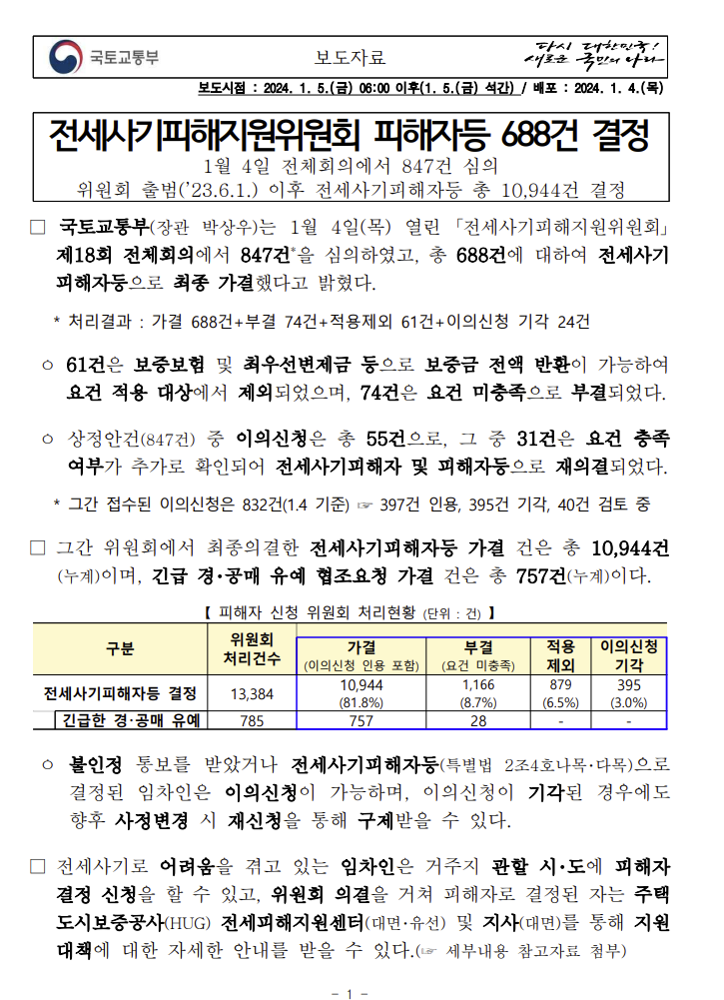
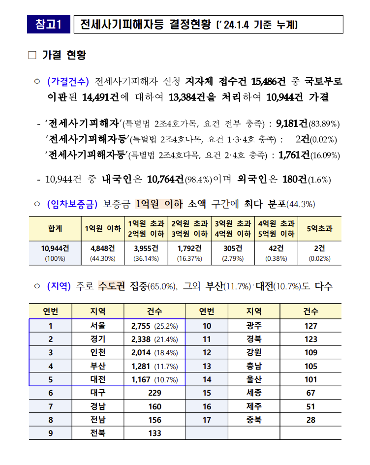
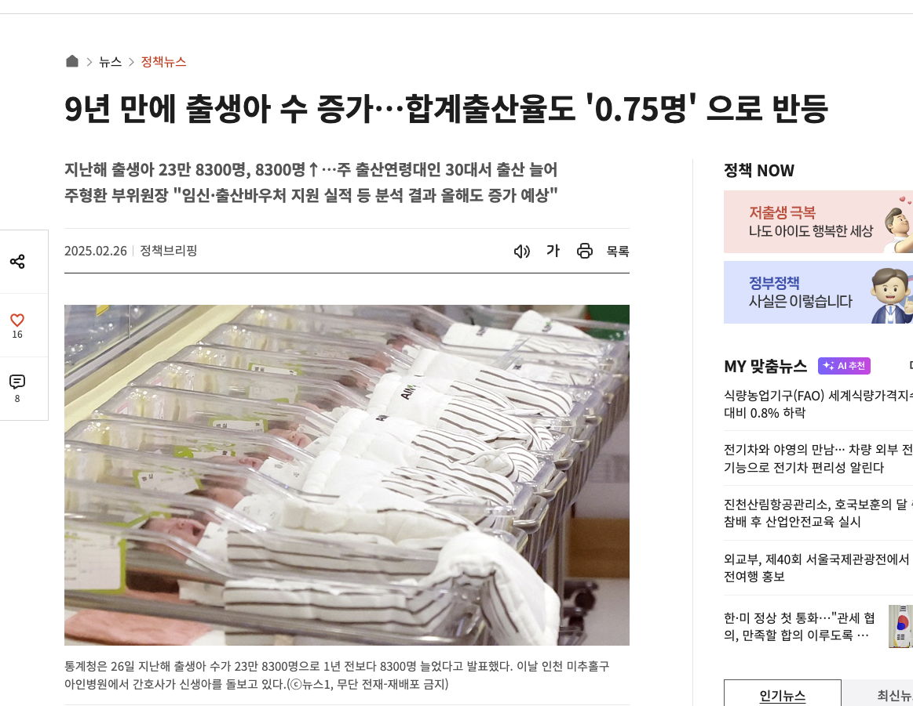

# 🏚️ MASTERNSLAVES - 내 돈 지켜


<br>
<h2>👥 팀원 소개</h2>
<table>
  <tr>
    <td align="center">
      
    </td>
    <td align="center">
      
    </td>
    <td align="center">
      
    </td>
    <td align="center">
      
    </td>
  </tr>
    <tr>
    <td align="center"> 김건동</td>
    <td align="center"> 김찬진</td>
    <td align="center">김진호</td>
    <td align="center"> 이우영 </td>
  </tr>
  <tr>
    <td align="center"><a href="https://github.com/astraglus03" target="_blank"></a>
    </td>
    <td align="center"><a href="https://github.com/Chanjin629" target="_blank"></a>
    </td>
    <td align="center"><a href="https://github.com/jinnn12" target="_blank"></a> 
    </td>
    <td align="center"><a href="https://github.com/ggj0228" target="_blank"></a>
    </td>
  </tr>
</table>

<br>

## 🎬🎞️ 프로젝트 개요

<h3>01_프로젝트 주제</h3>

경매로 넘어간 임대 건물 정보를 중심으로 전·월세 사기 피해자들이 건물 사기 또는 추천 정보를 등록하고 공유하는 커뮤니티 기반 시스템

<h3>02_프로젝트 소개</h3>

최근 급증하는 전세사기 피해 사례는 단순한 금융 피해를 넘어 주거 안정성 자체를 위협하고 있습니다. 2024년 1월 기준, 전세사기피해지원위원회에서 피해자로 공식 인정된 사례는 총 10,944건이며, 이 중 70% 이상이 40세 미만 청년층에 집중되어 있습니다. 청년과 사회초년생이 주로 거주하는 소형 다세대, 오피스텔, 다가구주택 등이 주요 피해 대상이라는 점에서, 정보의 비대칭과 취약한 법적 방어력이 전세사기의 근본 원인으로 작용하고 있음을 시사 하고 있습니다. 이러한 전·월세 사기를 방지하고자 이미 피해를 본 사례를 등록하여 정보를 공유하고자 하는 커뮤니티를 한번 즐겨보세요!

<h3>03_프로젝트 필요성</h3>

1. 증가하는 전·월세 사기<br>
 2024년 1월 기준, 피해자 공식 인정 건수는 10,944건으로 더 많은 전세사기가 일어나고 있다고 추산됩니다. 또한 더욱 경기가 안좋게 흘러감으로써 집주인이 건물을 두고 도망가는 상황이 많이 펼쳐지며 HUG에서도 보증해주려 하지 않고있으며 현재 피해자중 20~30대의 비율이 72.9%로 7,984건 입니다. 이러한 점에서 더욱더 사기가 일어나면 안되며 SNS시대에서 정보공유가 필수적이라고 강조합니다.

<div>
 
 
</div>
출처: 국토교통부(https://jeonse.kgeop.go.kr/) 

<br><br>
2. 감소하는 인구 비율<br>
 현재 인구가 매우 큰 폭으로 감소하고 있으며 현재 출산율이 0.75로 증가했음에도 아직 1이 넘지 않는것이 현실입니다. 또한 지금 지역별 출산율은 증가했을 수 있지만 전체 지역 합계 출산율로 계산해 보았을때 지속적으로 감소중입니다. 새로운 시대의 젊은 세대가 아이를 출산하기 위해서라도 사기가 일어나지않는 재발 방지 목적이 필요하다고 판단하였습니다.

 
출처: 대한민국 정책브리핑(https://www.korea.kr/news/policyNewsView.do?newsId=148940038)

<h3>04_프로젝트 주요 기능</h3>

- **피해 사례 등록**: 본인 인증 문서와 계약서를 기반으로 사건의 게시글을 등록 할 수 있습니다.
- **건물 검색**: 주소를 통해 해당 건물의 경매사건 후기를 조회 할 수 있습니다.
- **관리자 승인**: 등록된 글은 관리자가 검토 후 공개 할 수 있습니다.
- **커뮤니티 기능**: 댓글 및 피해사례 공유할 수 있습니다. 

<h3>05_서비스 차별화 전략</h3>

- **사건의 조회를 넘어서 정보를 공유함으로써 사기 예방이 가능하다.**  

<br>

## ⚙️🛠️ Technical Stack

<h2>DB</h2>

<a href="https://mariadb.org" target="_blank">
  
</a>

<h2>Tool</h2>

<div>


  
</div>

<br>

## 🗓️ WBS

<details>
  <summary>WBS 보기</summary>
</details>

[WBS]('')

<br>

## 🧾 요구사항 명세서

<details>
  <summary>요구사항 명세서 보기</summary>
</details>

[요구사항 명세서]('')

## 🧱 ERD

<details>
  <summary>ERD 보기</summary>
</details>

[ERD]('')

<br>

## 🧾 DDL
<details>
  <summary>회원 관련</summary>
  <details>
  <summary>1. 회원 테이블 생성하기</summary>

  ```sql
CREATE TABLE user (
    user_id BIGINT UNSIGNED NOT NULL AUTO_INCREMENT,
    email VARCHAR(255) NOT NULL,
    name VARCHAR(255) NOT NULL,
    password VARCHAR(255) NOT NULL,
    phone_number VARCHAR(255) DEFAULT NULL,
    created_at DATETIME NOT NULL DEFAULT CURRENT_TIMESTAMP,
    type ENUM('user', 'admin') NOT NULL DEFAULT 'user',
    PRIMARY KEY (user_id)
);
  ```
  </details>
  
</details>

<hr>


## 🧾 DML

<details>
  <summary>회원 관련</summary>

```sql
-- 예시

```
</details>

<hr>

## ⏳⏰ 테스트케이스 코드 및 실행

<details>
  <summary>회원 정보 관리</summary>
  <details>
    <summary>1. 회원 가입</summary>
  </details>
    <details>
    <summary>2. 회원 탈퇴</summary>
  </details>
    <details>
    <summary>3. 회원정보 수정</summary>
  </details>
    <details>
    <summary>4. 회원정보 조회</summary>
  </details>
</details>   

<hr>

<details>
  <summary>관리자 정보 관리</summary>
  <details>
    <summary>1. 관리자 가입</summary>
  </details>
    <details>
    <summary>2. 관리자 탈퇴</summary>
  </details>
    <details>
    <summary>3. 관리자 정보 수정</summary>
  </details>
    <details>
    <summary>4. 관리자 정보 조회</summary>
  </details>
</details>  

<hr>

<br>

## 📜 동료평가

| Name | <center>김건동</center> |
|:---:|:---|
| **김찬진** | 야무지게 잘하시네요 야무지게 잘하시네요 야무지게 잘하시네요 야무지게 잘하시네요 야무지게 잘하시네요 야무지게 잘하시네요 야무지게 잘하시네요 야무지게 잘하시네요 야무지게 잘하시네요 야무지게 잘하시네요 |
| **김진호** | 야무지게 잘하시네요 야무지게 잘하시네요 야무지게 잘하시네요 야무지게 잘하시네요 야무지게 잘하시네요 야무지게 잘하시네요 야무지게 잘하시네요 야무지게 잘하시네요 야무지게 잘하시네요 야무지게 잘하시네요 |
| **이우영** | 야무지게 잘하시네요 야무지게 잘하시네요 야무지게 잘하시네요 야무지게 잘하시네요 야무지게 잘하시네요 야무지게 잘하시네요 야무지게 잘하시네요 야무지게 잘하시네요 야무지게 잘하시네요 야무지게 잘하시네요 |

| Name | <center>김찬진</center> |
|:---:|:---|
| **김건동** | 야무지게 잘하시네요 야무지게 잘하시네요 야무지게 잘하시네요 야무지게 잘하시네요 야무지게 잘하시네요 야무지게 잘하시네요 야무지게 잘하시네요 야무지게 잘하시네요 야무지게 잘하시네요 야무지게 잘하시네요 |
| **김진호** | 야무지게 잘하시네요 야무지게 잘하시네요 야무지게 잘하시네요 야무지게 잘하시네요 야무지게 잘하시네요 야무지게 잘하시네요 야무지게 잘하시네요 야무지게 잘하시네요 야무지게 잘하시네요 야무지게 잘하시네요 |
| **이우영** | 야무지게 잘하시네요 야무지게 잘하시네요 야무지게 잘하시네요 야무지게 잘하시네요 야무지게 잘하시네요 야무지게 잘하시네요 야무지게 잘하시네요 야무지게 잘하시네요 야무지게 잘하시네요 야무지게 잘하시네요 |

| Name | <center>김진호</center> |
|:---:|:---|
| **김건동** | 야무지게 잘하시네요 야무지게 잘하시네요 야무지게 잘하시네요 야무지게 잘하시네요 야무지게 잘하시네요 야무지게 잘하시네요 야무지게 잘하시네요 야무지게 잘하시네요 야무지게 잘하시네요 야무지게 잘하시네요 |
| **김찬진** | 야무지게 잘하시네요 야무지게 잘하시네요 야무지게 잘하시네요 야무지게 잘하시네요 야무지게 잘하시네요 야무지게 잘하시네요 야무지게 잘하시네요 야무지게 잘하시네요 야무지게 잘하시네요 야무지게 잘하시네요 |
| **이우영** | 야무지게 잘하시네요 야무지게 잘하시네요 야무지게 잘하시네요 야무지게 잘하시네요 야무지게 잘하시네요 야무지게 잘하시네요 야무지게 잘하시네요 야무지게 잘하시네요 야무지게 잘하시네요 야무지게 잘하시네요 |

| Name | <center>이우영</center> |
|:---:|:---|
| **김건동** | 야무지게 잘하시네요 야무지게 잘하시네요 야무지게 잘하시네요 야무지게 잘하시네요 야무지게 잘하시네요 야무지게 잘하시네요 야무지게 잘하시네요 야무지게 잘하시네요 야무지게 잘하시네요 야무지게 잘하시네요 |
| **김찬진** | 야무지게 잘하시네요 야무지게 잘하시네요 야무지게 잘하시네요 야무지게 잘하시네요 야무지게 잘하시네요 야무지게 잘하시네요 야무지게 잘하시네요 야무지게 잘하시네요 야무지게 잘하시네요 야무지게 잘하시네요 |
| **김진호** | 야무지게 잘하시네요 야무지게 잘하시네요 야무지게 잘하시네요 야무지게 잘하시네요 야무지게 잘하시네요 야무지게 잘하시네요 야무지게 잘하시네요 야무지게 잘하시네요 야무지게 잘하시네요 야무지게 잘하시네요 |


