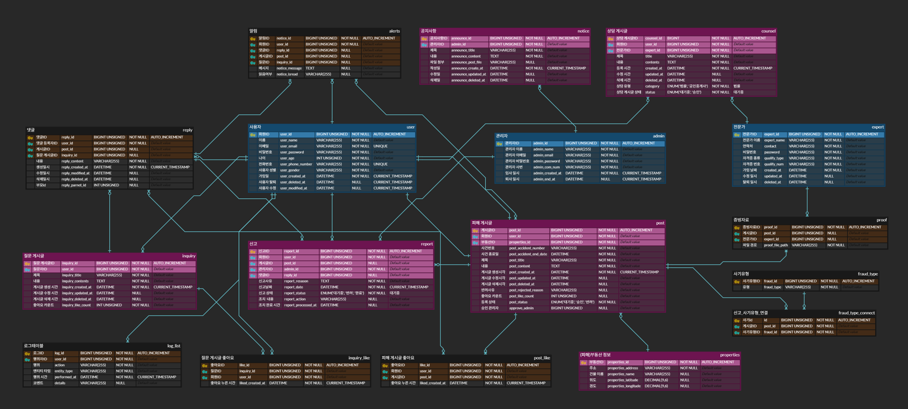

# 🏚️ MASTERNSLAVES - HomeProtector
<br>
<p align="center">
  
</p>

<details>
  <summary>로고 제작 과정</summary>
   
</details>

<h2>👥 팀원 소개</h2>
<table>
  <tr>
    <td align="center">
      
    </td>
    <td align="center">
      
    </td>
    <td align="center">
      
    </td>
    <td align="center">
      
    </td>
  </tr>
    <tr>
    <td align="center"> 김건동</td>
    <td align="center"> 김찬진</td>
    <td align="center">김진호</td>
    <td align="center"> 이우영 </td>
  </tr>
  <tr>
    <td align="center"><a href="https://github.com/astraglus03" target="_blank"></a>
    </td>
    <td align="center"><a href="https://github.com/Chanjin629" target="_blank"></a>
    </td>
    <td align="center"><a href="https://github.com/jinnn12" target="_blank"></a> 
    </td>
    <td align="center"><a href="https://github.com/ggj0228" target="_blank"></a>
    </td>
  </tr>
</table>

<br>

## 🎬🎞️ 프로젝트 개요

<h3>01_프로젝트 주제</h3>

경매로 넘어간 임대 건물 정보를 중심으로 전·월세 사기 피해자들이 건물 사기 또는 추천 정보를 등록하고 공유하는 커뮤니티 기반 시스템

<h3>02_프로젝트 소개</h3>

최근 급증하는 전세사기 피해 사례는 단순한 금융 피해를 넘어 주거 안정성 자체를 위협하고 있습니다. 2024년 1월 기준, 전세사기피해지원위원회에서 피해자로 공식 인정된 사례는 총 10,944건이며, 이 중 70% 이상이 40세 미만 청년층에 집중되어 있습니다. 청년과 사회초년생이 주로 거주하는 소형 다세대, 오피스텔, 다가구주택 등이 주요 피해 대상이라는 점에서, 정보의 비대칭과 취약한 법적 방어력이 전세사기의 근본 원인으로 작용하고 있음을 시사 하고 있습니다. 이러한 전·월세 사기를 방지하고자 이미 피해를 본 사례를 등록하여 정보를 공유하고자 하는 커뮤니티를 한번 즐겨보세요!

<h3>03_프로젝트 필요성</h3>

1. 증가하는 전·월세 사기<br>
 2024년 1월 기준, 피해자 공식 인정 건수는 10,944건으로 더 많은 전세사기가 일어나고 있다고 추산됩니다. 또한 더욱 경기가 안좋게 흘러감으로써 집주인이 건물을 두고 도망가는 상황이 많이 펼쳐지며 HUG에서도 보증해주려 하지 않고있으며 현재 피해자중 20~30대의 비율이 72.9%로 7,984건 입니다. 이러한 점에서 더욱더 사기가 일어나면 안되며 SNS시대에서 정보공유가 필수적이라고 강조합니다.

<div>
 
 
</div>
출처: 국토교통부(https://jeonse.kgeop.go.kr/) 

<br><br>
2. 감소하는 인구 비율<br>
 현재 인구가 매우 큰 폭으로 감소하고 있으며 현재 출산율이 0.75로 증가했음에도 아직 1이 넘지 않는것이 현실입니다. 또한 지금 지역별 출산율은 증가했을 수 있지만 전체 지역 합계 출산율로 계산해 보았을때 지속적으로 감소중입니다. 새로운 시대의 젊은 세대가 아이를 출산하기 위해서라도 사기가 일어나지않는 재발 방지 목적이 필요하다고 판단하였습니다.

 
출처: 대한민국 정책브리핑(https://www.korea.kr/news/policyNewsView.do?newsId=148940038)

<h3>04_프로젝트 주요 기능</h3>

- **피해 사례 등록**: 본인 인증 문서와 계약서를 기반으로 사건의 게시글을 등록 할 수 있습니다.
- **건물 검색**: 주소를 통해 해당 건물의 경매사건 후기를 조회 할 수 있습니다.
- **관리자 승인**: 등록된 글은 관리자가 검토 후 공개 할 수 있습니다.
- **커뮤니티 기능**: 댓글 및 피해사례 공유할 수 있습니다.
- **전문가와의 매칭**: 일반 사용자가 전문가와 매칭됨으로써 문제를 해결 할 수 있다.

<h3>05_서비스 차별화 전략</h3>

- **사건의 조회를 넘어서 정보를 공유함으로써 사기 예방이 가능하다.**  

<br>

## ⚙️🛠️ Technical Stack

<h2>DB</h2>

<a href="https://mariadb.org" target="_blank">
  
</a>

<h2>Tool</h2>

<div>


  
</div>

<br>

## 🗓️ WBS

<details>
  <summary>WBS 보기</summary>
   
</details>
<div style="font-size: 1.5em; font-weight: bold; margin-top: 20px;">
  <a href='https://docs.google.com/spreadsheets/d/15pLhr2YpBQbEitgeisUuU08xiQDuqLblhvuWDRGMyNs/edit?gid=632033879#gid=632033879' style="text-decoration: none; color: inherit;">
    WBS
  </a>
</div>

<br>

## 🧾 요구사항 명세서

<details>
  <summary>요구사항 명세서 보기</summary>
   
</details>

<div style="font-size: 1.5em; font-weight: bold; margin-top: 20px;">
  <a href='https://docs.google.com/spreadsheets/d/15pLhr2YpBQbEitgeisUuU08xiQDuqLblhvuWDRGMyNs/edit?gid=538827036#gid=538827036' style="text-decoration: none; color: inherit;">
    요구사항 명세서
  </a>
</div>

## 🧱 ERD

<details>
  <summary>ERD 보기</summary>
   
</details>
<div style="font-size: 1.5em; font-weight: bold; margin-top: 20px;">
  <a href='https://www.erdcloud.com/d/DvuCQXPY5ve8hbFBH' style="text-decoration: none; color: inherit;">
    ERD
  </a>
</div>

<br>

## 🧾 DDL
<details>
  <summary>DDL</summary>
  <details>
  <summary>1. 회원 테이블 생성하기</summary>

  ```sql
CREATE TABLE user (	
user_id BIGINT UNSIGNED NOT NULL AUTO_INCREMENT,	
user_name VARCHAR(255) NOT NULL,	
user_email VARCHAR(255) NOT NULL UNIQUE,	
user_password VARCHAR(255) NOT NULL,	
user_age INT UNSIGNED NOT NULL,	
user_phone_number VARCHAR(255) NOT NULL UNIQUE,	
user_gender VARCHAR(255) NOT NULL,	
user_created_at DATETIME NOT NULL DEFAULT CURRENT_TIMESTAMP,	
user_deleted_at DATETIME NULL,	
user_modified_at DATETIME NULL,	
PRIMARY KEY (user_id)	
);	
  ```
  </details>
    <details>
  <summary>2. 관리자 테이블 생성하기</summary>

  ```sql
CREATE TABLE admin (			
admin_id BIGINT UNSIGNED NOT NULL AUTO_INCREMENT,			
admin_name VARCHAR(255) NOT NULL,			
admin_email VARCHAR(255) NOT NULL,			
admin_password VARCHAR(255) NOT NULL,			
admin_com_num VARCHAR(255) NOT NULL,			
admin_created_at DATETIME NOT NULL DEFAULT CURRENT_TIMESTAMP,			
admin_end_at DATETIME NULL,			
PRIMARY KEY (admin_id)			
);		
  ```
  </details>
    <details>
  <summary>3. 부동산 정보 테이블 생성하기</summary>

  ```sql
CREATE TABLE properties (		
properties_id BIGINT UNSIGNED NOT NULL AUTO_INCREMENT,		
properties_address VARCHAR(255) NOT NULL,		
properties_name VARCHAR(255) NULL,		
properties_latitude DECIMAL(9,6) NULL,		
properties_longitude DECIMAL(9,6) NULL,		
PRIMARY KEY (properties_id)		
);		
  ```
  </details>
    <details>
  <summary>4. 전문가 테이블 생성하기</summary>

  ```sql
CREATE TABLE expert (	
expert_id BIGINT UNSIGNED NOT NULL AUTO_INCREMENT,	
expert_name VARCHAR(255) NOT NULL,	
contact VARCHAR(255) NOT NULL,	
password VARCHAR(255) NOT NULL,	
qualify_type VARCHAR(255) NOT NULL,	
qualify_num VARCHAR(255) NOT NULL,	
created_at DATETIME NOT NULL,	
updated_at DATETIME NULL,	
deleted_at DATETIME NULL,	
PRIMARY KEY (expert_id)	
);	
  ```
  </details>
    <details>
  <summary>5. 사기타입 테이블 생성하기</summary>

  ```sql
CREATE TABLE fraud_type (			
fraud_id BIGINT UNSIGNED NOT NULL AUTO_INCREMENT,			
fraud_type VARCHAR(255) NOT NULL,			
PRIMARY KEY (fraud_id)			
);		
  ```
  </details>
    <details>
  <summary>6. 피해 테이블 생성하기</summary>

  ```sql
CREATE TABLE post (		
post_id BIGINT UNSIGNED NOT NULL AUTO_INCREMENT,		
user_id BIGINT UNSIGNED NOT NULL,		
properties_id BIGINT UNSIGNED NOT NULL,		
post_accident_number VARCHAR(255) NOT NULL,		
post_accident_end_date DATETIME NOT NULL,		
post_title VARCHAR(255) NOT NULL,		
post_content TEXT NOT NULL,		
post_status ENUM('대기중', '승인', '반려') NOT NULL DEFAULT '대기중',		
post_created_at DATETIME NOT NULL DEFAULT CURRENT_TIMESTAMP,		
post_updated_at DATETIME NULL,		
post_deleted_at DATETIME NULL,		
post_rejected_reason VARCHAR(255) NULL,		
post_like_count INT UNSIGNED NULL,		
approve_admin BIGINT UNSIGNED NULL,		
PRIMARY KEY (post_id),		
FOREIGN KEY (user_id) REFERENCES user (user_id),		
FOREIGN KEY (properties_id) REFERENCES properties (properties_id)		
);	
  ```
  </details>
    <details>
  <summary>7. 질문 테이블 생성하기</summary>

  ```sql
CREATE TABLE inquiry (		
inquiry_id BIGINT UNSIGNED NOT NULL AUTO_INCREMENT,		
user_id BIGINT UNSIGNED NOT NULL,		
inquiry_title VARCHAR(255) NOT NULL,		
inquiry_contents TEXT NOT NULL,		
inquiry_created_at DATETIME NOT NULL DEFAULT CURRENT_TIMESTAMP,		
inquiry_updated_at DATETIME NULL,		
inquiry_deleted_at DATETIME NULL,		
PRIMARY KEY (inquiry_id),		
FOREIGN KEY (user_id) REFERENCES user (user_id)		
);		
  ```
  </details>
    <details>
  <summary>8. 공지사항 테이블 생성하기</summary>

  ```sql
CREATE TABLE notice (	
announce_id BIGINT UNSIGNED NOT NULL AUTO_INCREMENT,	
admin_id BIGINT UNSIGNED NOT NULL,	
announce_title VARCHAR(255) NOT NULL,	
announce_content TEXT NOT NULL,	
announce_post_file VARCHAR(255) NULL,	
announce_create_at DATETIME NOT NULL DEFAULT CURRENT_TIMESTAMP,	
announce_updated_at DATETIME NULL,	
announce_deleted_at DATETIME NULL,	
PRIMARY KEY (announce_id),	
FOREIGN KEY (admin_id) REFERENCES admin (admin_id)	
);	
  ```
  </details>
    <details>
  <summary>9. 상담 테이블 생성하기</summary>

  ```sql
CREATE TABLE counsel (		
counsel_id BIGINT NOT NULL AUTO_INCREMENT,		
user_id BIGINT UNSIGNED NOT NULL,		
expert_id BIGINT UNSIGNED NOT NULL,		
title VARCHAR(255) NOT NULL,		
contents TEXT NOT NULL,		
created_at DATETIME NOT NULL DEFAULT CURRENT_TIMESTAMP,		
updated_at DATETIME NULL,		
deleted_at DATETIME NULL,		
category ENUM('법률', '공인중개사') NOT NULL DEFAULT '법률',		
status ENUM('대기중', '승인') NOT NULL DEFAULT '대기중',		
PRIMARY KEY (counsel_id),		
FOREIGN KEY (user_id) REFERENCES user (user_id),		
FOREIGN KEY (expert_id) REFERENCES expert (expert_id)		
);	
  ```
  </details>
      <details>
  <summary>10. 댓글 테이블 생성하기</summary>

  ```sql
CREATE TABLE reply (		
reply_id BIGINT UNSIGNED NOT NULL AUTO_INCREMENT,		
post_id BIGINT UNSIGNED,		
user_id BIGINT UNSIGNED NOT NULL,		
inquiry_id BIGINT UNSIGNED,		
reply_content VARCHAR(255) NOT NULL,		
reply_created_at TIMESTAMP NOT NULL DEFAULT CURRENT_TIMESTAMP,		
reply_modified_at TIMESTAMP NULL,		
reply_deleted_at TIMESTAMP NULL,		
reply_parent_id INT UNSIGNED NULL,		
PRIMARY KEY (reply_id),		
FOREIGN KEY (post_id) REFERENCES post (post_id),		
FOREIGN KEY (user_id) REFERENCES user (user_id),		
FOREIGN KEY (inquiry_id) REFERENCES inquiry (inquiry_id)		
);		
  ```
  </details>
      <details>
  <summary>11. 증빙자료 테이블 생성하기</summary>

  ```sql
CREATE TABLE proof (	
proof_id BIGINT UNSIGNED NOT NULL AUTO_INCREMENT,	
post_id BIGINT UNSIGNED NOT NULL,	
expert_id BIGINT UNSIGNED NOT NULL,	
proof_file_path VARCHAR(255) NOT NULL,	
PRIMARY KEY (proof_id),	
FOREIGN KEY (post_id) REFERENCES post (post_id),	
FOREIGN KEY (expert_id) REFERENCES expert (expert_id)	
);	
  ```
  </details>
      <details>
  <summary> 12. 신고 테이블 생성하기</summary>

  ```sql
CREATE TABLE report (		
report_id BIGINT UNSIGNED NOT NULL AUTO_INCREMENT,		
user_id BIGINT UNSIGNED NOT NULL,		
post_id BIGINT UNSIGNED,		
admin_id BIGINT UNSIGNED NULL,		
reply_id BIGINT UNSIGNED,		
report_resason TEXT NOT NULL,		
report_date DATETIME NOT NULL DEFAULT CURRENT_TIMESTAMP,		
report_status ENUM('대기중', '완료') NOT NULL DEFAULT '대기중',		
report_action VARCHAR(255) NOT NULL,		
report_processed_at DATETIME NULL,		
PRIMARY KEY (report_id),		
FOREIGN KEY (user_id) REFERENCES user (user_id),		
FOREIGN KEY (post_id) REFERENCES post (post_id),		
FOREIGN KEY (admin_id) REFERENCES admin (admin_id),		
FOREIGN KEY (reply_id) REFERENCES reply (reply_id)		
);		
  ```
  </details>
      <details>
  <summary>13. 알림 테이블 생성하기</summary>

  ```sql
CREATE TABLE alerts (	
notice_id BIGINT UNSIGNED NOT NULL AUTO_INCREMENT,	
user_id BIGINT UNSIGNED NOT NULL,	
reply_id BIGINT UNSIGNED NULL,	
post_id BIGINT UNSIGNED NULL,	
inquiry_id BIGINT UNSIGNED NULL,	
notice_message TEXT NULL,	
notice_isread VARCHAR(255) NULL,	
PRIMARY KEY (notice_id),	
FOREIGN KEY (user_id) REFERENCES user (user_id),	
FOREIGN KEY (reply_id) REFERENCES reply (reply_id),	
FOREIGN KEY (post_id) REFERENCES post (post_id),	
FOREIGN KEY (inquiry_id) REFERENCES reply (inquiry_id)	
);	
  ```
  </details>
      <details>
  <summary>14. 로그 테이블 생성하기</summary>

  ```sql
CREATE TABLE log_list (	
log_id BIGINT UNSIGNED NOT NULL AUTO_INCREMENT,	
user_id BIGINT UNSIGNED NOT NULL,	
action VARCHAR(255) NOT NULL,	
entity_type VARCHAR(255) NOT NULL,	
performed_at DATETIME NOT NULL DEFAULT CURRENT_TIMESTAMP,	
details VARCHAR(255) NULL,	
PRIMARY KEY (log_id),	
FOREIGN KEY (user_id) REFERENCES user (user_id)	
);	
  ```
  </details>
      <details>
  <summary>15. 피해 게시글 좋아요 테이블 생성하기</summary>

  ```sql
CREATE TABLE post_like (			
like_id BIGINT UNSIGNED NOT NULL AUTO_INCREMENT,			
post_id BIGINT UNSIGNED NOT NULL,			
user_id BIGINT UNSIGNED NOT NULL,			
liked_created_at DATETIME NOT NULL DEFAULT CURRENT_TIMESTAMP,			
PRIMARY KEY (like_id),			
UNIQUE (post_id, user_id),			
FOREIGN KEY (post_id) REFERENCES post (post_id),			
FOREIGN KEY (user_id) REFERENCES user (user_id)			
);	
  ```
  </details>
      <details>
  <summary>16. 질문 게시글 좋아요 테이블 생성하기</summary>

  ```sql
CREATE TABLE inquiry_like (	
like_id BIGINT UNSIGNED NOT NULL AUTO_INCREMENT,	
inquiry_id BIGINT UNSIGNED NOT NULL,	
user_id BIGINT UNSIGNED NOT NULL,	
liked_created_at DATETIME NOT NULL DEFAULT CURRENT_TIMESTAMP,	
PRIMARY KEY (like_id),	
UNIQUE (inquiry_id, user_id),	
FOREIGN KEY (inquiry_id) REFERENCES inquiry (inquiry_id),	
FOREIGN KEY (user_id) REFERENCES user (user_id)	
);	
  ```
  </details>

  <details>
  <summary>16. 질문 게시글 좋아요 테이블 생성하기</summary>

  ```sql
CREATE TABLE fraud_type_connect (			
id BIGINT UNSIGNED NOT NULL AUTO_INCREMENT,			
post_id BIGINT UNSIGNED NOT NULL,			
fraud_id BIGINT UNSIGNED NOT NULL,			
PRIMARY KEY (id),			
FOREIGN KEY (post_id) REFERENCES post (post_id),			
FOREIGN KEY (fraud_id) REFERENCES fraud_type (fraud_id)			
);			

  ```
  </details>
  
</details>

<hr>


## 🧾⏳⏰ DML 및 테스트케이스 진행.

<details>
  <summary>DML</summary>
  <details>
     <summary>회원 관련</summary>
      <details>
     <summary> 1. 회원 등록</summary>
      </details>
          <details>
     <summary> 2. 회원 수정</summary>
      </details>
          <details>
     <summary> 3. 회원 탈퇴</summary>
      </details>
          <details>
     <summary> 4. 회원 조회</summary>
      </details>
  </details>

  <details>
  <summary>관리자 정보 관리</summary>
  <details>
    <summary>1. 관리자 가입</summary>
       
  </details>
    <details>
    <summary>2. 관리자 탈퇴</summary>
      
  </details>
    <details>
    <summary>3. 관리자 정보 수정</summary>
      
  </details>
    <details>
    <summary>4. 관리자 정보 조회</summary>
      
  </details>
   </details>
  
  <details>
     <summary>전문가 관련</summary>
      <details>
     <summary> 1. 전문가 등록</summary>
      </details>
          <details>
     <summary> 2. 전문가 수정</summary>
      </details>
          <details>
     <summary> 3. 전문가 탈퇴</summary>
      </details>
          <details>
     <summary> 4. 전문가 조회</summary>
      </details>
  </details>

 <details>
     <summary>피해 게시글 관련</summary>
      <details>
     <summary> 1. 피해 게시글 등록 요청</summary>
      </details>
          <details>
     <summary> 2. 피해 게시글 수정 요청</summary>
      </details>
          <details>
     <summary> 3. 피해 게시글 삭제 요청</summary>
      </details>
          <details>
     <summary> 4. 피해 게시글 조회</summary>
      </details>
      <details>
     <summary> 5. 피해 게시글 등록 승인</summary>
      </details>
          <details>
     <summary> 6. 피해 게시글 수정 승인</summary>
      </details>
          <details>
     <summary> 7. 피해 게시글 삭제 승인</summary>
      </details>
  </details>
  
  
 <details>
     <summary>질문 게시글 관련</summary>
      <details>
     <summary> 1. 질문 게시글 등록</summary>
        
      </details>
          <details>
     <summary> 2. 질문 게시글 수정</summary>
            
      </details>
          <details>
     <summary> 3. 질문 게시글 삭제</summary>
            
      </details>
          <details>
     <summary> 4. 질문 게시글 조회</summary>
            
      </details>
  </details>

   <details>
     <summary>공지사항 관련</summary>
      <details>
     <summary> 1. 공지사항 등록</summary>
        
      </details>
          <details>
     <summary> 2. 공지사항 수정</summary>
            
      </details>
          <details>
     <summary> 3. 공지사항 삭제</summary>
            
      </details>
          <details>
     <summary> 4. 공지사항 조회</summary>
      </details>
  </details>

 <details>
     <summary>댓글 관련</summary>
      <details>
     <summary> 1. 댓글 등록</summary>
        
      </details>
          <details>
     <summary> 2. 댓글 수정</summary>
       
      </details>
          <details>
     <summary> 3. 댓글 삭제</summary>
        
      </details>
          <details>
     <summary> 4. 댓글 조회</summary>
         
      </details>
    <details>
        <summary> 5. 대댓글 등록</summary>
       
      </details>
          <details>
     <summary> 6. 대댓글 수정</summary>
        
      </details>
          <details>
     <summary> 7. 대댓글 삭제</summary>
        
      </details>
          <details>
     <summary> 8. 대댓글 조회</summary>
        
      </details>
</details>
   <details>
     <summary>알림 관련</summary>
      <details>
     <summary> 1. 알림 조회</summary>
      </details>
  </details>

   <details>
     <summary>신고 관련</summary>
      <details>
     <summary> 1. 피해 게시글 신고 요청</summary>
      </details>
          <details>
     <summary> 2. 피해 게시글 댓글 신고 요청</summary>
      </details>
      <details>
     <summary> 3. 피해 게시글 신고 승인</summary>
      </details>
          <details>
     <summary> 4. 피해 게시글 댓글 신고 승인</summary>
      </details>
  </details>
  
   <details>
     <summary>로그 관련</summary>
      <details>
     <summary> 1.로그 조회</summary>
      </details>
  </details>
  
   <details>
     <summary>좋아요 관련</summary>
      <details>
     <summary> 1. 좋아요 등록</summary>
      
      </details>
          <details>
     <summary> 2. 좋아요 취소</summary>
      
      </details>
  </details>
</details>  
  <hr>

<br>

## 🎉 회고

- 김건동
  -
- 김찬진
  -
- 김진호
  -
- 이우영
  - 

